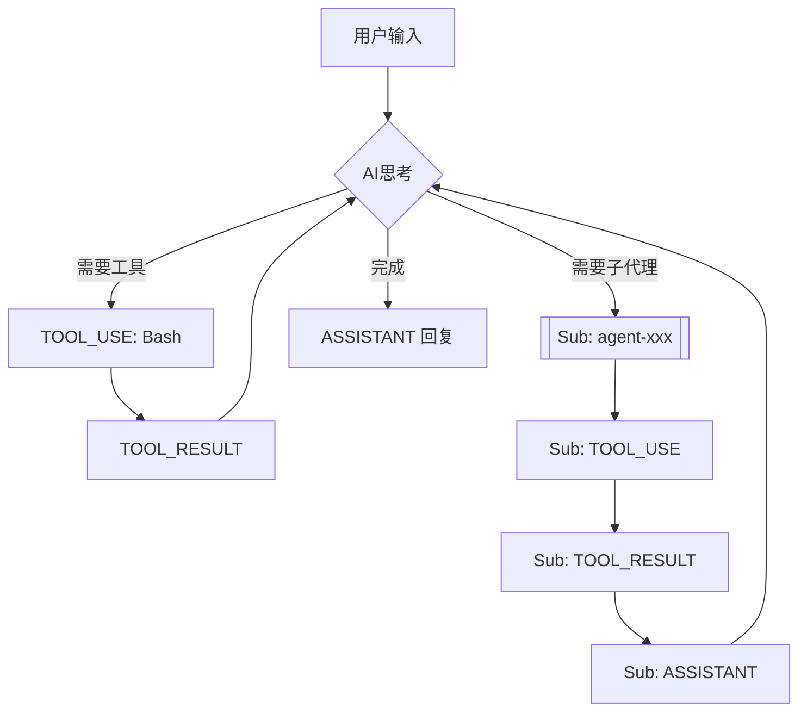

# Claude Code 执行日志分析器

## 日志格式规范

分析日志前，请先阅读 `${CLAUDE_PLUGIN_ROOT}/docs/log-format-spec.md` 了解：
- 日志文件组织结构
- JSON Lines 记录格式
- 消息类型（user/assistant/progress）
- 关键字段（uuid, parentUuid, timestamp, agentId 等）
- 子代理日志位置

## 执行步骤

### 步骤 0：接收可选参数

用户可能提供关键词参数，格式：
- `/cclog-analyzer` - 无参数，显示所有提问
- `/cclog-analyzer 简化` - 有参数，过滤包含"简化"的提问

### 步骤 1：获取用户提问列表

**调用方式（必须传入当前会话 ID）：**
```bash
python ${CLAUDE_PLUGIN_ROOT}/scripts/find_and_list_prompts.py ${CLAUDE_SESSION_ID}
```

`${CLAUDE_SESSION_ID}` 会自动替换为当前会话 ID，脚本直接使用该文件，无需猜测。

**注意：如果脚本执行失败（返回非0退出码或输出错误信息），则停止执行并告知用户。**

**输出格式：**
```
timestamp|content-preview|uuid
```

### 步骤 2：过滤与选择

**如果用户提供了参数（关键词）：**
1. 用关键词匹配所有提问的 `content-preview`
2. 匹配结果：
   - **1个匹配** → 直接使用，跳过选择
   - **多个匹配** → 只展示匹配项，让用户选择
   - **0个匹配** → 提示"未找到匹配，显示所有提问"，然后展示全部让用户选择

**如果用户未提供参数：**
- 展示所有提问，让用户选择

**⚠️ 重要：不要让 AI 去搜索日志文件**

如果过滤后没有匹配项，**展示所有候选让用户选择**，禁止 AI 自己用 grep 等工具去搜索日志文件。

**选择流程示例：**

```
# 多个匹配（参数="简化"）
找到 2 个匹配项：
1. [2026-03-14 13:05:04] 简化 cclog-analyzer 这个插件...
2. [2026-03-14 13:30:12] 简化代码结构...

# 1个匹配（参数="测试脚本"）
找到 1 个匹配项，直接分析：
[2026-03-14 13:05:04] 测试脚本...

# 0个匹配（参数="不存在的词"）
未找到匹配，显示所有候选：
1. [2026-03-14 13:05:04] 这是 bullet 物理引擎代码...
2. [2026-03-14 13:30:12] 请分析 LinearMath 模块...
3. [2026-03-14 14:00:45] 帮我找出碰撞检测...

❌ 禁止：AI 自己去 grep 日志文件
✅ 正确：展示所有候选，让用户选择
```

**获取：** `prompt-uuid`

### 步骤 3：深度遍历提取执行树

```bash
python ${CLAUDE_PLUGIN_ROOT}/scripts/extract_deep_execution.py ${CLAUDE_SESSION_ID} {prompt-uuid}
```

**注意：如果脚本执行失败（返回非0退出码或输出错误信息），则停止执行并告知用户。**

**⚠️ 重要：直接解析 JSON，不要用 Python 脚本处理**

步骤3的输出是 JSON Lines 格式，**直接逐行读取并解析即可**。
- 不要写 Python 脚本来处理
- 不要用 `python -c` 或 `python script.py` 来解析
- 每行是一个完整 JSON 对象，直接用内置 JSON 解析

**输出格式：**
每行一条 JSON 记录，已简化（无 uuid、usage 等冗余字段）：

```json
{"type": "user", "message": {"role": "user", "content": "..."}, "timestamp": "...", "_source": "MAIN"}
{"type": "assistant", "message": {"role": "assistant", "content": [...]}, "timestamp": "...", "_source": "agent-xxx"}
```

- `"_source": "MAIN"` - 主会话记录
- `"_source": "agent-{id}"` - 子代理记录

### 步骤 4：生成 Markdown 分析报告

**⚠️ 重要：直接逐行解析，禁止写 Python 脚本**

步骤3的输出是 JSON Lines 格式，**直接读取后逐行用内置 JSON 解析即可**：
- ❌ 禁止：写 `python script.py` 或 `python -c` 来处理
- ❌ 禁止：调用任何外部工具来解析 JSON
- ✅ 正确：直接逐行读取，内置解析每行 JSON

将解析结果写入 Markdown 文件（当前工作目录的 docs 文件夹）：

```
./docs/cclog-{日期时间}-{用户提问摘要}.md
```

如果当前目录的 `docs` 目录不存在，请先创建它。

**文件名示例：**
- `cclog-20260322-150530-简化ccloganalyzer.md`
- `cclog-20260322-151245-分析执行流程.md`

**摘要生成规则：**
- 取用户提问前 15 个字符（去除特殊字符）
- 中文直接保留，空格转为 `-`
- 总长度控制在 50 字符以内

**Markdown 格式模板：**

```markdown
# Claude Code 执行分析报告

**会话**: {session-file}
**分析时间**: {timestamp}
**记录总数**: {total}

---

## 执行流程

### 1. 用户提问

**内容：**
用户输入的内容（完整保留）

---

### 2. AI 思考

**思考过程：**
AI 的思考内容

---

### 3. 工具调用

**工具**: Bash
**参数**:
```json
{"command": "...", "description": "..."}
```

---

### 4. 工具返回

**结果**:
工具返回结果（过长则截断）

---

### 5. [Sub] AI 回复

> 子代理执行结果

---

### 6. AI 总结回复

最终回复内容

---

## 统计信息

| 指标 | 数值 |
|------|------|
| 总记录数 | X |
| 主会话记录 | X |
| 子代理记录 | X |
| 工具调用次数 | X |
```

**格式规则：**
- 每条记录作为一个 `###` 小节
- 主会话：`### 序号. 标题`，如 `### 1. 用户提问`
- 子代理：`### 序号. [Sub] 标题`，如 `### 8. [Sub] 工具调用`
- ⚠️ 注意：序号必须在前，然后是 `[Sub]` 标记，不要写成 `[Sub] 8. 标题`
- 代码块：tool_use 的 input 用 JSON 代码块展示
- 引用块：子代理的输出用 `>` 引用块包裹
- 分隔线：每条记录之间用 `---` 分隔

**内容处理规则：**
- `USER` 类型：**完整保留** `message.content`
- `ASSISTANT` 类型：完整保留 `message.content`
- `THINKING` 类型：显示 `thinking` 字段内容
- `TOOL_USE` 类型：`name` + `input` 用 JSON 代码块
- `TOOL_RESULT` 类型：`output` 截断到 500 字符，超长用代码块包裹

**流程图（Mermaid）：**

在报告末尾添加 Mermaid 流程图，合并相似步骤，展示执行流程：

```markdown
## 执行流程图


```

**流程图规则：**
- 合并连续的同类型步骤（如多个 thinking 合并为一个 AI思考节点）
- 主会话用默认样式，子代理用 `[[ ]]` 双线框
- 循环：AI思考 → 工具调用 → 工具结果 → 回到 AI思考
- 使用 `flowchart TD` 从上到下布局
- 工具名称简化为 `TOOL_USE: {name}`

**完成报告后：**
告知用户报告已保存到 `{文件路径}`

## 重要原则

1. **深度优先**：遇到子代理调用，立即处理完子代理全部记录，再返回主会话
2. **输出到文件**：将分析结果写入 Markdown 文件，不要直接输出到对话
3. **文档格式**：使用 Markdown 标题、代码块、引用块等格式，便于阅读
4. **子代理标识**：子代理记录使用 `[Sub]` 标记，与主会话明确区分
5. **完整内容**：用户输入（USER类型）必须完整保留，不要截断
