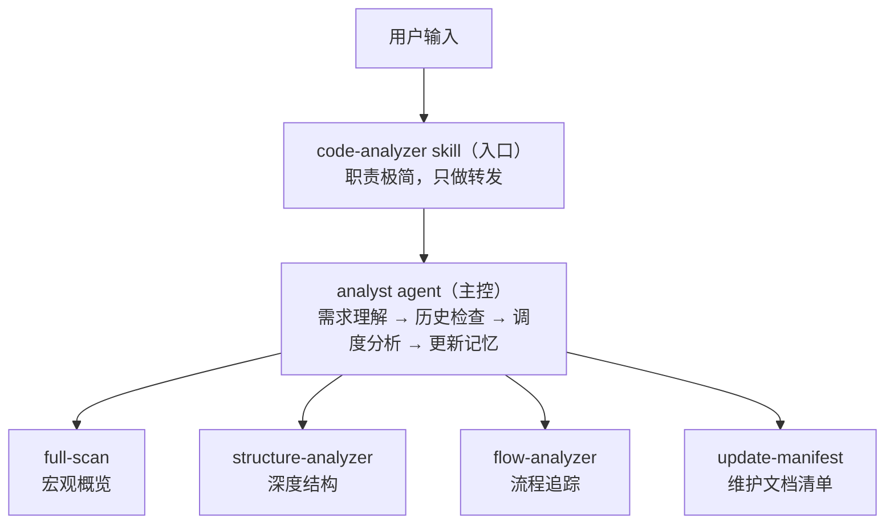

# Code Analyzer 插件设计方案

## 1. 设计目标

提供一套游戏代码分析工作流，支持多种分析类型（整体扫描、结构分析、流程分析），通过 manifest 实现跨会话记忆，避免重复分析。

## 2. 架构模式

**1 入口 Skill + 1 主控 Agent + N 分析 Skills + 1 记忆 Skill**

## 3. 设计决策

### 3.1 为什么要入口 Skill？

提供 `/code-analyzer` 触发点，让用户有明确的交互入口。入口层只做转发，不承担逻辑，所有智能判断交给 Agent。

### 3.2 为什么用 1 个 Agent 调度？

将需求理解、历史检查、路径决策、任务调度集中在一个 Agent 中，避免多 Agent 间的协调开销。Agent 不做具体分析，只做决策和编排。

### 3.3 为什么每次只分析一个模块的一种类型？

每次分析作为原子任务由 subagent 执行，天然控制上下文窗口大小，避免大项目分析时上下文溢出。用户可多次调用覆盖不同模块和类型。

### 3.4 为什么分析 Skills 用 disable-model-invocation？

强制所有分析请求经过 Agent 调度层，确保历史检查、路径决策、manifest 更新等流程不被跳过。

### 3.5 为什么评分标准分两层？

通用维度（可读性/可维护性/正确性）放 `spec.md` 避免重复，各 Skill 只定义自己领域的额外维度。Agent 启动时读 spec.md，规范知识随调度链传递。

### 3.6 为什么不按语言拆分 Skill？

游戏项目通常是混合语言（C++ + Lua、C# + Shader 等），按语言拆分会导致 Skill 数量爆炸。在单个 Skill 内部做语言探测和适配更合理。

### 3.7 为什么需要 manifest 记忆机制？

- 跨会话保持分析历史，避免重复分析
- 支持历史检查和覆盖确认
- 提供按类型/范围的快速导航
- `rebuild` 操作可从文档目录重建清单，容错性强

## 4. 扩展方式

| 扩展需求 | 做法 |
|----------|------|
| 新增分析类型 | 添加 Skill + 在 Agent 中注册触发关键词 |
| 新增评分维度 | 在对应 Skill 中添加额外维度表 |
| 适配新语言/引擎 | 在现有 Skill 内部增加语言探测和差异化分析策略 |
