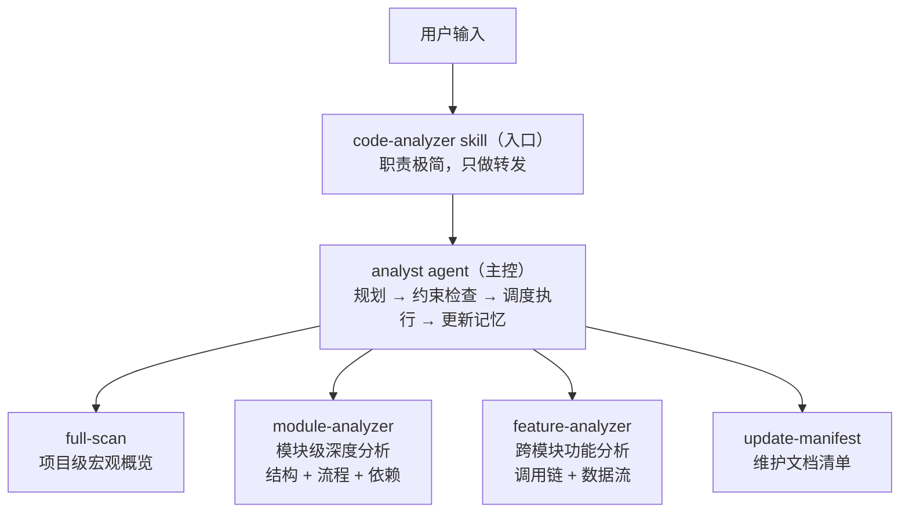
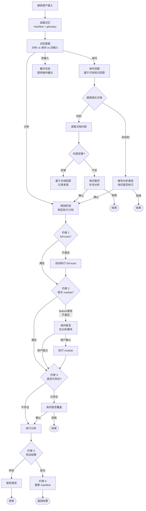

# Code Analyzer 插件设计方案

## 1. 设计目标

提供一套游戏代码分析工作流，支持三种分析粒度（项目级整体扫描、模块级深度分析、跨模块功能分析），通过 manifest 实现跨会话记忆，避免重复分析。

核心设计理念：**约束驱动，而非流程驱动**。定义不可违反的约束规则，让 AI 根据具体情况自主规划最优执行路径。

## 2. 架构模式

**1 入口 Skill + 1 主控 Agent + N 分析 Skills + 1 记忆 Skill**

## 3. 设计决策

### 3.0 为什么采用约束驱动而非流程驱动？

固定流程（A0→A1→A2...）虽然清晰，但缺乏灵活性：
- 无法处理复杂场景（如多模块 feature 需要动态决策）
- AI 只能机械执行，无法发挥智能规划能力

约束驱动的优势：
- **灵活性**：满足约束的前提下，AI 可自主决定最优路径
- **健壮性**：约束是目标导向的，执行路径可动态调整
- **智能性**：AI 需要先思考"如何满足所有约束"，再行动

### 3.1 为什么 Agent 同时承担分析和询问？

两种意图共享同一套前置逻辑（读 manifest、了解历史），区别只在后半段：分析走 Skill 调度，询问走文档检索。拆成两个 Agent 反而要重复 manifest 加载逻辑。询问时如果发现没有相关文档，还能无缝转入分析流程。

### 3.2 为什么要入口 Skill？

提供 `/code-analyzer` 触发点，让用户有明确的交互入口。入口层只做转发，不承担逻辑，所有智能判断交给 Agent。

### 3.3 为什么用 1 个 Agent 调度？

将需求理解、历史检查、路径决策、任务调度集中在一个 Agent 中，避免多 Agent 间的协调开销。Agent 不做具体分析，只做决策和编排。

### 3.4 为什么按项目级/模块级划分而非按结构/流程划分？

结构和流程是同一模块的两个视角，分开分析会割裂认知（看完结构不知道怎么跑，看完流程不知道类关系）。按粒度划分更自然：项目级做宏观概览，模块级做一次性的综合深入分析。每次分析作为原子任务由 subagent 执行，控制上下文窗口大小。

### 3.5 为什么分析 Skills 用 disable-model-invocation？

强制所有分析请求经过 Agent 调度层，确保历史检查、路径决策、manifest 更新等流程不被跳过。

### 3.6 为什么评分标准分两层？

通用维度（可读性/可维护性/正确性）放 `spec.md` 避免重复，各 Skill 只定义自己领域的额外维度。Agent 启动时读 spec.md，规范知识随调度链传递。

### 3.7 为什么不按语言拆分 Skill？

游戏项目通常是混合语言（C++ + Lua、C# + Shader 等），按语言拆分会导致 Skill 数量爆炸。在单个 Skill 内部做语言探测和适配更合理。

### 3.8 为什么需要 manifest 记忆机制？

- 跨会话保持分析历史，避免重复分析
- 支持历史检查和覆盖确认
- 提供按类型/范围的快速导航
- `rebuild` 操作可从文档目录重建清单，容错性强
- **核心作用**：作为知识库支持询问模式，让 AI 能够基于已有分析回答问题

## 4. Analyst Agent 设计原则

analyst 是 code-analyzer 的核心调度组件。采用**约束驱动**设计：定义不可违反的规则，让 AI 根据具体情况自主规划执行路径。

### 4.1 核心约束（不可违反）

违反约束将导致工作失败，必须在执行前检查并确保满足。

| 约束 | 规则 | 检查方式 | 不满足时的处理 | 目的 |
|------|------|----------|----------------|------|
| **约束 1** | 全局认知优先：任何分析之前，确保 full-scan 已存在 | 查看 manifest 中是否有 `type: full-scan` | 自动先执行 root full-scan，无需询问 | 建立全局认知，避免盲人摸象 |
| **约束 2** | 模块基础优先：执行 feature 分析前，确保相关模块已有 module 分析 | 提取 feature 涉及的所有模块，检查每个模块是否有 `module` 文档 | 列出缺失模块，询问用户是否先执行 module 分析；用户可跳过 | 确保跨模块分析有模块级知识基础 |
| **约束 3** | 利用已有知识：回答用户问题前，必须先检查并优先使用已有分析文档 | 根据问题关键词，在 manifest 中匹配相关文档 | 发现相关文档→必须读取并基于文档回答；未发现→推导分析类型，询问是否执行分析 | 避免重复劳动，发挥记忆系统价值 |
| **约束 4** | 避免重复覆盖：相同 scope + type 的文档已存在时，询问用户是否覆盖 | 在 manifest 中查找相同 `scope` 和 `type` 的记录 | 展示文档名、生成时间、摘要，询问是否重新分析 | 尊重已有工作，防止意外覆盖 |
| **约束 5** | 结果可验证：分析完成后，必须验证输出文件 | 读取生成的文件，确认存在且非空，检查结构 | 验证失败→报告错误，不更新 manifest | 确保分析真正成功 |
| **约束 6** | 记忆必须更新：成功生成文档后，必须更新 manifest | 验证通过后立即执行 | 调用 `update-manifest`，传递 doc_name, scope, type, summary | 维护分析历史，支持后续查询 |

### 4.2 工作流程：规划 → 执行

Agent 采用**两阶段工作模式**：

### 4.3 意图判断

| 意图 | 识别特征 | 处理方式 |
|------|----------|----------|
| **分析** | 包含"分析"、"扫描"、"审计"；或指定了分析类型；或明确路径+类型组合 | 进入规划阶段，制定执行计划 |
| **询问** | 包含"？"、"吗"、"怎么"、"是什么"、"有哪些"等疑问词 | 进入询问流程，基于已有知识回答 |
| **空输入** | 用户只输入 `/code-analyzer` 无其他内容 | 展示当前状态和可操作选项 |

**歧义处理**：无法明确判断时，**询问用户**而非猜测。

### 4.4 分析类型选择

三种分析类型，analyst 根据用户意图和当前状态灵活选择：

| 类型 | 触发关键词 | 前置条件 | 输出文档 |
|------|-----------|----------|----------|
| `full-scan` | 整体、概览、扫描、全局、项目结构 | 无 | `root-full-scan.md` |
| `module` | 模块、结构、流程、依赖、类关系、深度分析 | full-scan 已存在 | `{scope}-module.md` |
| `feature` | 功能、系统、跨模块、追踪、调用链、数据流、机制 | full-scan + 相关 module 分析已存在 | `{scope}-feature.md` |

**类型推断示例**：
- "分析战斗模块" → 关键词"模块" → `module` 类型
- "子弹系统怎么实现的" → 关键词"系统"、"怎么实现" → `feature` 类型
- "项目整体架构" → 关键词"整体"、"架构" → `full-scan` 类型

### 4.5 询问模式处理

询问模式下，analyst 必须**优先利用已有知识**回答：

**文档匹配策略**：

| 问题类型 | 优先查找 | 匹配方式 |
|----------|----------|----------|
| 模块内部细节（初始化、依赖、类关系） | `module` 文档 | 按模块路径匹配 |
| 功能机制（如何实现、调用链、数据流） | `feature` 文档 | 按功能名称匹配 |
| 项目整体问题（有哪些模块、层级关系） | `full-scan` 文档 | 直接返回 |

**模块名→路径映射**：
- 如关键词是模块名而非路径（如"战斗"），查阅 full-scan 文档中的模块分布表
- 将模块名映射为实际路径（如"战斗"→`./src/battle`）

**回答要求**：
1. **必须读取**文档内容
2. **必须基于文档内容组织答案**，引用具体章节
3. **必须标注来源**：`（参考：[{doc_name}](./docs/code-analyzer/{doc_name})）`
4. 内容不足时，告知缺失信息，询问是否补充分析

### 4.6 复杂场景处理

#### 场景 1：多模块 feature 分析

用户："分析战斗系统的数据流"

**规划**：
1. 识别涉及模块：battle、network、database、ui...
2. 检查各模块是否有 module 文档
3. 发现 network、database 未分析
4. **询问用户**："network 和 database 模块尚未分析，是否先执行 module 分析？"
5. 根据用户选择：
   - 先补全 module，再执行 feature
   - 或跳过直接执行 feature（告知风险）

#### 场景 2：渐进式询问

用户："渲染模块的渲染流程是怎样的？"

**执行**：
1. 检查是否有 render 模块的 module 文档
2. 有 → 读取第6章"关键流程"
3. 基于流程图和表格回答
4. 用户追问："渲染管线的具体实现呢？"
5. 读取第3章"类关系图"、第4章"内部依赖"
6. 基于已有内容继续回答
7. 发现内容不足（如缺少 Shader 管理细节）
8. 询问："是否需要对 render 模块重新分析，重点关注 Shader 管理？"

#### 场景 3：从询问转入分析

用户："技能系统是如何工作的？"

**执行**：
1. 检查是否有 skill-system 的 feature 文档
2. 无 → 告知用户尚未分析
3. 询问："是否执行 feature 分析来回答此问题？预计需要分析 skill、buff、effect 等模块。"
4. 用户确认
5. **规划执行路径**：
   - 检查 skill、buff、effect 是否有 module 文档
   - 如有缺失，先询问是否补全
   - 执行 feature-analyzer
   - 基于生成的文档回答用户问题

### 4.7 自主决策空间

在满足约束的前提下，analyst 拥有自主决策权：

| 决策点 | 约束 | 自主空间 |
|--------|------|----------|
| 执行顺序 | 必须满足所有约束 | 可自主决定步骤先后顺序（如先执行哪个缺失的 module） |
| 依赖处理 | 必须满足约束 1 和 2 | 可自动执行缺失的前置分析，或询问用户 |
| 参数推断 | 必须提取 scope 和 type | 可从自然语言中智能推断 |
| 询问回答 | 必须优先使用已有知识 | 可决定是否建议补充分析 |
| 错误恢复 | 必须报告错误 | 可建议替代方案（如缩小 scope） |

## 5. 扩展方式

| 扩展需求 | 做法 |
|----------|------|
| 新增分析类型 | 添加 Skill + 在 Agent 约束中注册新类型 + 更新 manifest 类型映射 |
| 新增评分维度 | 在对应 Skill 中添加额外维度表 |
| 适配新语言/引擎 | 在现有 Skill 内部增加语言探测和差异化分析策略 |
| 新增约束 | 在"核心约束"章节添加新约束，说明检查方式和处理方法 |
