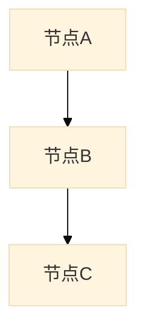
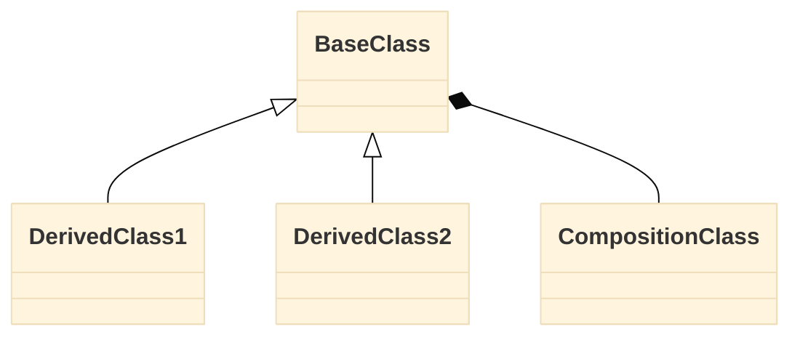

# code-analyzer 输出文档规范

本文档定义 code-analyzer 插件所有分析报告的通用格式规范。

## 0. 文档元信息（Frontmatter）

每份分析报告必须在文件顶部包含 YAML frontmatter：

```yaml
---
name: {文档名称}
description: |
  一句话描述分析内容。
---
```

## 1. 文档基本结构

```markdown
# {报告标题}

> [返回 Manifest](./manifest.md) | [返回 full-scan](./root-full-scan.md)  <!-- 如适用 -->

## 导航

| 章节 | 链接 | 快速跳转 |
|------|------|----------|
| ... | ... | ... |

---

## {章节1}
...

**[↑ 返回顶部](#导航)** | **[← 上一章] | [→ 下一章]**  <!-- 除最后章节外 -->

## {章节N}
...

---

**文档导航**：[返回顶部](#导航) | [返回 Manifest](./manifest.md) | [返回 full-scan](./root-full-scan.md)

*生成时间: {YYYY-MM-DD HH:MM}*
```

## 2. 导航系统规范

### 2.1 顶部导航表格

必须位于文档开头、标题之后的首个章节之前。

### 2.2 章节间导航链接

每个章节末尾必须包含导航链接（最后一个章节除外）：

```markdown
**[↑ 返回顶部](#导航)** | **[← 上一章：标题](#锚点)** | **[→ 下一章：标题](#锚点)**
```

最后一个章节末尾只需：

```markdown
**[↑ 返回顶部](#导航)** | **[← 上一章：标题](#锚点)**
```

### 2.3 文档末尾导航栏

文档末尾必须包含固定导航栏：

```markdown
---

**文档导航**：[返回顶部](#导航) | [返回 Manifest](./manifest.md) | [返回 full-scan](./root-full-scan.md)

*生成时间: {YYYY-MM-DD HH:MM}*
```

## 3. Mermaid 图表规范

### 3.1 通用配置

所有 Mermaid 图表必须包含初始化配置：

```mermaid
%%{init: {'theme': 'base', 'flowchart': { 'useMaxWidth': true, 'htmlLabels': true, 'curve': 'basis' }}}%%
```

### 3.2 流程图（graph TD/BT/LR）



### 3.3 类图（classDiagram）



### 3.4 节点样式建议

- 使用 `[文字]` 定义节点文本
- 子图使用 `subgraph 名称[""]` 语法
- 可使用 `style 节点 fill:#颜色` 添加背景色

## 4. 表格规范

### 4.1 基本表格

```markdown
| 列1 | 列2 | 列3 |
|------|------|------|
| 值1 | 值2 | 值3 |
```

### 4.2 代码链接单元格

使用以下格式嵌入文件路径和行号：

```markdown
| 类名 | 职责 | 代码链接 |
|------|------|----------|
| GameManager | 游戏主管理器 | [`📄 定义`](path/file.cs#L10) |
```

## 5. 状态指示

健康度、问题等级等状态使用以下 emoji：

| 状态 | emoji |
|------|-------|
| 优秀/低风险 | 🟢 |
| 良好/中风险 | 🟡 |
| 需关注/高风险 | 🔴 |

## 6. 输出文件命名

### 6.1 文件名公式

`${normalized(scope)}-${type}`

其中 `normalized(scope)` 规则：
- `.` → `root`
- 路径分隔符 `/` → `-`（如 `./src/battle` → `src-battle`）
- 不含前导 `./`（如 `./src` → `src`）

### 6.2 文件名对照表

| scope | full-scan | module | feature |
|-------|-----------|--------|---------|
| `.` | `root-full-scan` | `root-module` | `root-feature` |
| `./src` | `src-full-scan` | `src-module` | `src-feature` |
| `./src/battle` | `src-battle-full-scan` | `src-battle-module` | `src-battle-feature` |

### 6.3 输出位置

统一输出到 `./docs/code-analyzer/` 目录。
