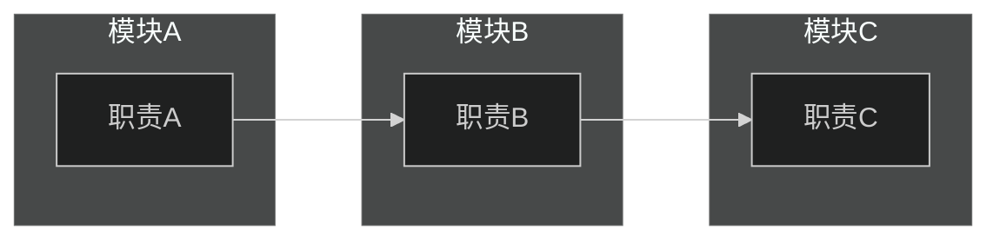
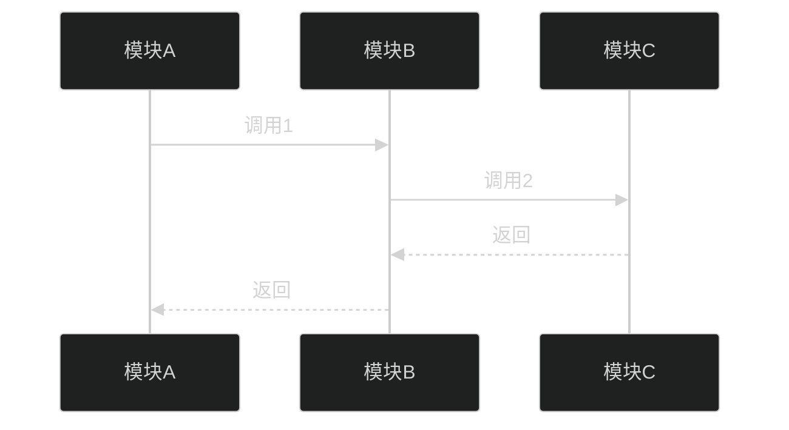
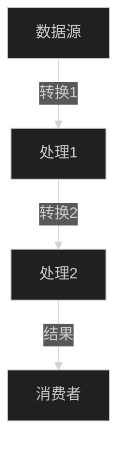

# {功能名} 跨模块分析

> [返回 Manifest](./manifest.md) | [返回 full-scan](./root-full-scan.md)

## 导航

| 章节 | 链接 | 快速跳转 |
|------|------|----------|
| 1. 功能概览 | [#1-功能概览](#1-功能概览) | 功能定义、涉及模块 |
| 2. 模块职责 | [#2-模块职责](#2-模块职责) | 各模块在功能中的角色 |
| 3. 调用链分析 | [#3-调用链分析](#3-调用链分析) | 跨模块调用链路 |
| 4. 数据流分析 | [#4-数据流分析](#4-数据流分析) | 数据传递和转换 |
| 5. 架构健康度快照 | [#5-架构健康度快照](#5-架构健康度快照) | 🟢🟡🔴 评估 |
| 6. 问题与建议 | [#6-问题与建议](#6-问题与建议) | 改进建议 |

---

## 1. 功能概览

### 1.1 功能定义

{功能描述}

### 1.2 涉及模块

| 模块 | 路径 | 在功能中的角色 |
|------|------|----------------|
| {模块名} | {路径} | {角色} |

### 1.3 功能入口

| 入口点 | 类型 | 位置 | 代码链接 |
|--------|------|------|----------|
| {入口名称} | {函数/事件/API} | {模块} | [`📄`]({路径}#L{行号}) |

**[↑ 返回顶部](#导航)** | **[→ 下一章：模块职责](#2-模块职责)**

---

## 2. 模块职责

### 2.1 各模块职责摘要

| 模块 | 职责 | 关键文件 |
|------|------|----------|
| {模块名} | {职责} | {文件列表} |

### 2.2 模块交互概览

**[↑ 返回顶部](#导航)** | **[← 上一章：功能概览](#1-功能概览)** | **[→ 下一章：调用链分析](#3-调用链分析)**

---

## 3. 调用链分析

### 3.1 完整调用链

### 3.2 关键调用点

| 序号 | 调用方 | 被调用方 | 函数 | 职责 | 代码链接 |
|------|--------|----------|------|------|----------|
| 1 | {模块A} | {模块B} | {函数名} | {职责} | [`📄`]({路径}#L{行号}) |

### 3.3 跨模块边界分析

| 边界 | 调用方向 | 耦合类型 | 评价 |
|------|----------|----------|------|
| A → B | 单向 | {数据/控制} | 🟢🟡🔴 |

**[↑ 返回顶部](#导航)** | **[← 上一章：模块职责](#2-模块职责)** | **[→ 下一章：数据流分析](#4-数据流分析)**

---

## 4. 数据流分析

### 4.1 核心数据结构

| 数据 | 类型 | 定义位置 | 说明 |
|------|------|----------|------|
| {数据名} | {配置/状态/事件} | {模块} | {说明} |

### 4.2 数据流转图

### 4.3 数据生命周期

| 数据 | 生产者 | 转换点 | 消费者 |
|------|--------|--------|--------|
| {数据名} | {模块A} | {模块B} | {模块C} |

**[↑ 返回顶部](#导航)** | **[← 上一章：调用链分析](#3-调用链分析)** | **[→ 下一章：架构健康度快照](#5-架构健康度快照)**

---

## 5. 架构健康度快照

### 5.1 各维度评估

| 维度 | 评分 | 说明 |
|------|------|------|
| 职责清晰度 | 🟢🟡🔴 | {说明} |
| 调用链清晰度 | 🟢🟡🔴 | {说明} |
| 数据流合理性 | 🟢🟡🔴 | {说明} |
| 耦合度 | 🟢🟡🔴 | {说明} |
| 扩展性 | 🟢🟡🔴 | {说明} |

### 5.2 跨模块问题

| 问题 | 严重程度 | 涉及模块 | 说明 |
|------|----------|----------|------|
| {循环依赖/过度耦合} | 🔴 | {模块A, 模块B} | {说明} |

**[↑ 返回顶部](#导航)** | **[← 上一章：数据流分析](#4-数据流分析)** | **[→ 下一章：问题与建议](#6-问题与建议)**

---

## 6. 问题与建议

### 6.1 现存问题

| 问题 | 影响 | 优先级 | 建议解决方案 |
|------|------|--------|--------------|
| {问题} | {影响} | P{0/1/2} | {方案} |

### 6.2 优化建议

1. **{建议标题}**：{详细说明}
2. **{建议标题}**：{详细说明}

### 6.3 相关参考

- {模块名} 模块分析：[{文件名}](./{文件名})

**[↑ 返回顶部](#导航)** | **[← 上一章：架构健康度快照](#5-架构健康度快照)**

---

**文档导航**：[返回顶部](#导航) | [返回 Manifest](./manifest.md) | [返回 full-scan](./root-full-scan.md)

*生成时间: {YYYY-MM-DD HH:MM}*
