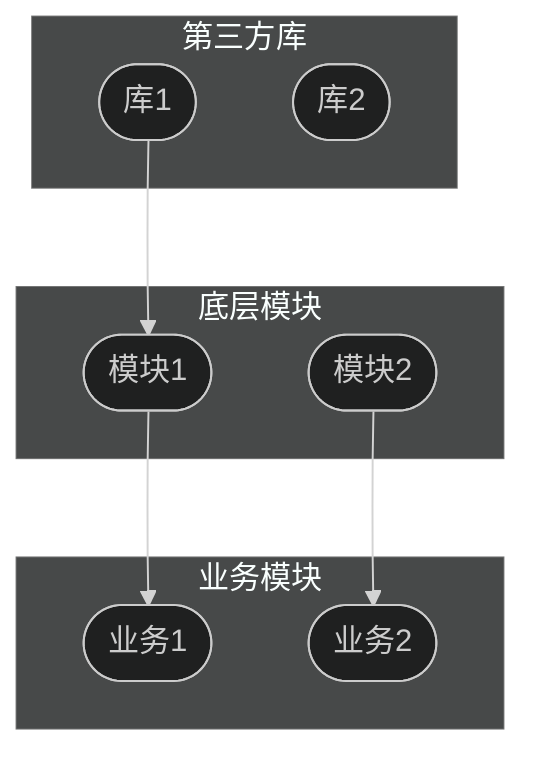
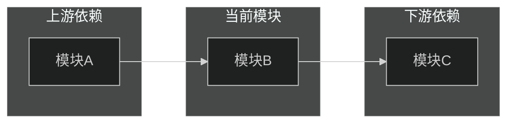
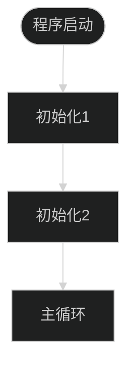
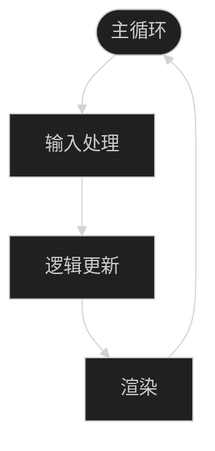

# {项目名} 整体结构分析

> [返回 Manifest](./manifest.md)

## 导航

| 章节 | 链接 | 快速跳转 |
|------|------|----------|
| 1. 项目概览 | [#1-项目概览](#1-项目概览) | 代码统计、语言分布 |
| 2. 模块分布 | [#2-模块分布](#2-模块分布) | 第三方库、底层、业务模块 |
| 3. 模块层级图 | [#3-模块层级图](#3-模块层级图) | Mermaid 图表 |
| 4. 宏观依赖方向 | [#4-宏观依赖方向](#4-宏观依赖方向) | 模块间依赖关系 |
| 5. 引擎级流程概览 | [#5-引擎级流程概览](#5-引擎级流程概览) | 初始化、主循环 |
| 6. 架构健康度快照 | [#6-架构健康度快照](#6-架构健康度快照) | 🟢🟡🔴 评估 |
| 7. 后续分析建议 | [#7-后续分析建议](#7-后续分析建议) | 下一步分析方向 |

---

## 1. 项目概览

### 1.1 代码统计

| 指标 | 数值 |
|------|------|
| 总代码行数 | {行数} |
| 代码文件数 | {文件数} |
| 模块数 | {模块数} |

### 1.2 语言分布

| 语言 | 文件数 | 占比 |
|------|--------|------|
| {语言1} | {数量} | {百分比} |
| {语言2} | {数量} | {百分比} |

**[↑ 返回顶部](#导航)** | **[→ 下一章：模块分布](#2-模块分布)**

---

## 2. 模块分布

### 2.1 第三方库

| 库名 | 路径 | 用途 | 许可证 |
|------|------|------|--------|
| {库名} | {路径} | {用途} | {许可证} |

### 2.2 底层模块

| 模块名 | 路径 | 职责 | 代码规模 |
|--------|------|------|----------|
| {模块名} | {路径} | {职责} | {行数} |

### 2.3 业务模块

| 模块名 | 路径 | 功能分类 | 场景绑定 | 代码规模 |
|--------|------|----------|----------|----------|
| {模块名} | {路径} | {分类} | {是/否} | {行数} |

**[↑ 返回顶部](#导航)** | **[← 上一章：项目概览](#1-项目概览)** | **[→ 下一章：模块层级图](#3-模块层级图)**

---

## 3. 模块层级图

**[↑ 返回顶部](#导航)** | **[← 上一章：模块分布](#2-模块分布)** | **[→ 下一章：宏观依赖方向](#4-宏观依赖方向)**

---

## 4. 宏观依赖方向

| 模块 | 上游依赖 | 下游依赖 |
|------|----------|----------|
| {模块名} | {上游列表} | {下游列表} |

**[↑ 返回顶部](#导航)** | **[← 上一章：模块层级图](#3-模块层级图)** | **[→ 下一章：引擎级流程概览](#5-引擎级流程概览)**

---

## 5. 引擎级流程概览

### 5.1 初始化流程

### 5.2 主循环结构

| 阶段 | 说明 |
|------|------|
| {阶段1} | {说明} |
| {阶段2} | {说明} |

**[↑ 返回顶部](#导航)** | **[← 上一章：宏观依赖方向](#4-宏观依赖方向)** | **[→ 下一章：架构健康度快照](#6-架构健康度快照)**

---

## 6. 架构健康度快照

| 维度 | 评分 | 说明 |
|------|------|------|
| 模块划分清晰度 | 🟢🟡🔴 | {说明} |
| 依赖合理性 | 🟢🟡🔴 | {说明} |
| 耦合度控制 | 🟢🟡🔴 | {说明} |
| 扩展性 | 🟢🟡🔴 | {说明} |

### 发现的问题

| 问题 | 严重程度 | 位置 | 建议 |
|------|----------|------|------|
| {问题描述} | 🔴 | {位置} | {建议} |

**[↑ 返回顶部](#导航)** | **[← 上一章：引擎级流程概览](#5-引擎级流程概览)** | **[→ 下一章：后续分析建议](#7-后续分析建议)**

---

## 7. 后续分析建议

基于整体扫描结果，建议优先进行以下深度分析：

| 优先级 | 模块/功能 | 分析类型 | 理由 |
|--------|-----------|----------|------|
| {P0/P1/P2} | {模块名} | {module/feature} | {理由} |

---

**文档导航**：[返回顶部](#导航) | [返回 Manifest](./manifest.md)

*生成时间: {YYYY-MM-DD HH:MM}*
