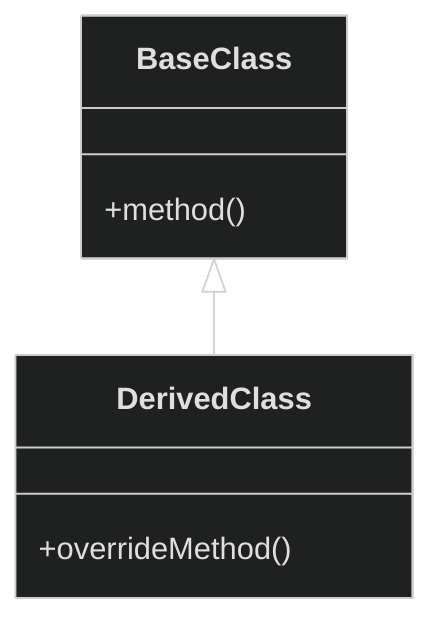
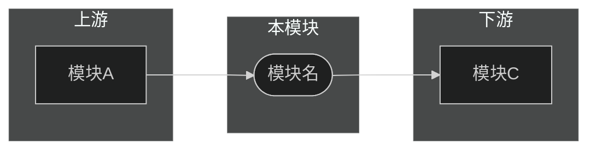
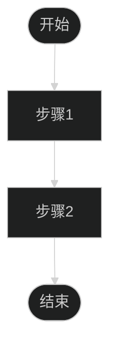

# {模块名} 模块分析

> [返回 Manifest](./manifest.md) | [返回 full-scan](./root-full-scan.md)

## 导航

| 章节 | 链接 | 快速跳转 |
|------|------|----------|
| 1. 模块概述 | [#1-模块概述](#1-模块概述) | 职责、定位、规模 |
| 2. 目录结构 | [#2-目录结构](#2-目录结构) | 目录树、组织分析 |
| 3. 核心类关系 | [#3-核心类关系](#3-核心类关系) | 继承、组合关系图 |
| 4. 内部依赖 | [#4-内部依赖](#4-内部依赖) | 子模块依赖图 |
| 5. 外部关系 | [#5-外部关系](#5-外部关系) | 上下游依赖 |
| 6. 关键流程 | [#6-关键流程](#6-关键流程) | 核心业务流程 |
| 7. 架构健康度 | [#7-架构健康度](#7-架构健康度) | 🟢🟡🔴 评估 |

---

## 1. 模块概述

### 1.1 基本信息

| 属性 | 值 |
|------|-----|
| 模块路径 | `{scope}` |
| 代码规模 | {行数} |
| 文件数量 | {文件数} |
| 核心职责 | {职责描述} |

### 1.2 在系统中的定位

{描述模块在整体架构中的位置，与周边模块的关系}

**[↑ 返回顶部](#导航)** | **[→ 下一章：目录结构](#2-目录结构)**

---

## 2. 目录结构

```
{模块路径}
├── {subdir1}/
│   ├── {file1}
│   └── {file2}
├── {subdir2}/
│   └── ...
└── ...
```

### 2.1 目录组织分析

| 目录 | 职责 | 评价 |
|------|------|------|
| {目录名} | {职责} | 🟢🟡🔴 {说明} |

**[↑ 返回顶部](#导航)** | **[← 上一章：模块概述](#1-模块概述)** | **[→ 下一章：核心类关系](#3-核心类关系)**

---

## 3. 核心类关系

### 3.1 类图



### 3.2 类职责表

| 类名 | 职责 | 代码链接 |
|------|------|----------|
| {类名} | {职责} | [`📄 定义`]({路径}#L{行号}) |

**[↑ 返回顶部](#导航)** | **[← 上一章：目录结构](#2-目录结构)** | **[→ 下一章：内部依赖](#4-内部依赖)**

---

## 4. 内部依赖

### 4.1 子模块依赖图


### 4.2 依赖矩阵

| 子模块 | 被谁依赖 | 依赖谁 | 内聚度 |
|--------|----------|--------|--------|
| {子模块} | {列表} | {列表} | 🟢🟡🔴 |

**[↑ 返回顶部](#导航)** | **[← 上一章：核心类关系](#3-核心类关系)** | **[→ 下一章：外部关系](#5-外部关系)**

---

## 5. 外部关系

### 5.1 上游依赖（谁依赖我）

| 模块 | 引用位置 | 用途 |
|------|----------|------|
| {模块名} | [`📄`]({路径}#L{行号}) | {用途} |

### 5.2 下游依赖（我依赖谁）

| 模块 | 被引用位置 | 用途 |
|------|------------|------|
| {模块名} | [`📄`]({路径}#L{行号}) | {用途} |

### 5.3 外部关系图



**[↑ 返回顶部](#导航)** | **[← 上一章：内部依赖](#4-内部依赖)** | **[→ 下一章：关键流程](#6-关键流程)**

---

## 6. 关键流程

### 6.1 {流程名称}



| 步骤 | 函数/类 | 职责 | 代码链接 |
|------|---------|------|----------|
| 1 | {函数名} | {职责} | [`📄`]({路径}#L{行号}) |

**[↑ 返回顶部](#导航)** | **[← 上一章：外部关系](#5-外部关系)** | **[→ 下一章：架构健康度](#7-架构健康度)**

---

## 7. 架构健康度

### 7.1 各维度评估

| 维度 | 评分 | 说明 |
|------|------|------|
| 目录组织 | 🟢🟡🔴 | {说明} |
| 子模块划分 | 🟢🟡🔴 | {说明} |
| 类设计 | 🟢🟡🔴 | {说明} |
| 依赖管理 | 🟢🟡🔴 | {说明} |
| 流程清晰度 | 🟢🟡🔴 | {说明} |
| 健壮性 | 🟢🟡🔴 | {说明} |

### 7.2 发现的问题

| 问题 | 严重程度 | 位置 | 建议 |
|------|----------|------|------|
| {问题描述} | 🔴 | {位置} | {建议} |

### 7.3 优点总结

- {优点1}
- {优点2}

**[↑ 返回顶部](#导航)** | **[← 上一章：关键流程](#6-关键流程)**

---

**文档导航**：[返回顶部](#导航) | [返回 Manifest](./manifest.md) | [返回 full-scan](./root-full-scan.md)

*生成时间: {YYYY-MM-DD HH:MM}*
