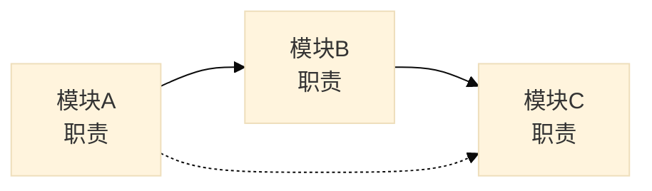
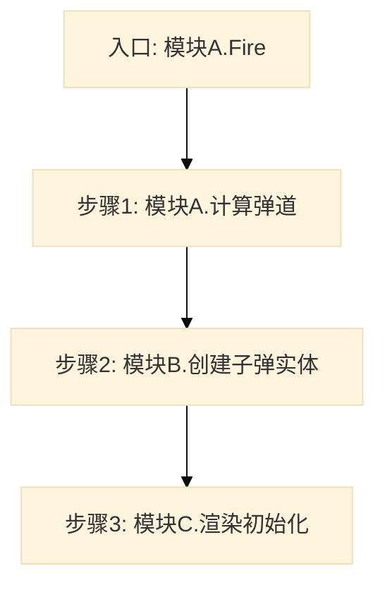

对指定功能或系统进行跨模块分析，追踪其在多个模块中的实现和交互。

**定位：跨模块功能分析。** 关注功能如何跨越模块边界，识别调用链、数据流和模块间依赖关系。
与 `module` 的区别：`module` 深入单个模块内部，`feature` 横向追踪跨模块的功能实现。

## 工作流程

1. **功能边界识别**
   - 从 `scope` 和上下文识别功能名称（如"子弹系统"、"战斗初始化"）
   - 如 `scope` 是路径，自动发现该路径下与功能相关的代码
   - 如 `scope` 是功能名称，通过 Grep 搜索功能关键词定位相关文件和模块

2. **功能入口识别**
   - 搜索功能相关的公开接口、事件监听、初始化函数
   - 识别功能的主要触发点和对外暴露的 API
   - 记录入口点的模块归属

3. **跨模块调用链追踪**
   - 从入口开始，使用 `Grep` 追踪函数调用链
   - 记录调用链跨越的模块边界，标注每个模块的职责
   - 识别核心中转点和关键交互

4. **数据流分析**
   - 识别功能涉及的核心数据结构（配置、状态、事件等）
   - 追踪数据如何在模块间传递和转换
   - 标注数据的生产者、消费者和转换点

5. **模块职责归纳**
   - 汇总每个参与模块在功能中的角色
   - 分析模块间的依赖方向和耦合程度

6. **生成功能级架构健康度快照**
   - 评估跨模块功能的健康度维度：职责清晰度、调用链清晰度、数据流合理性、耦合度、扩展性
   - 识别跨模块调用中的问题：循环依赖、过度耦合、职责模糊
   - 汇总分析结果，输出健康度总览和关键问题摘要

7. **生成功能分析文档**
   - 输出到指定的 `output_file`
   - 包含功能概览、调用链图、数据流图、模块职责矩阵、架构健康度快照

## 输入参数

| 参数 | 类型 | 必填 | 说明 |
|------|------|------|------|
| `scope` | string | 是 | 功能名称或主路径（如"子弹系统"或"./src/bullet"） |
| `output_file` | string | 是 | 输出文件路径，由调用方指定 |
| `key_modules` | string[] | 否 | 用户指定的关键模块路径，优先分析 |
| `notes` | string | 否 | 用户指定的重点关注事项 |

## 输出文档结构

```markdown
# 功能/系统分析：{功能名称}

> [返回 Manifest](./manifest.md)

## 导航

| 章节 | 链接 | 快速跳转 |
|------|------|----------|
| 功能概览 | [#1-功能概览](#1-功能概览) | [↓ 跳转到此章节](#1-功能概览) |
| 模块职责 | [#2-模块职责](#2-模块职责) | [↓ 跳转到此章节](#2-模块职责) |
| 调用链分析 | [#3-调用链分析](#3-调用链分析) | [↓ 跳转到此章节](#3-调用链分析) |
| 数据流分析 | [#4-数据流分析](#4-数据流分析) | [↓ 跳转到此章节](#4-数据流分析) |
| 架构健康度 | [#5-架构健康度快照](#5-架构健康度快照) | [↓ 跳转到此章节](#5-架构健康度快照) |
| 问题与建议 | [#6-问题与建议](#6-问题与建议) | [↓ 跳转到此章节](#6-问题与建议) |

---

## 1. 功能概览

### 1.1 基本信息

| 属性 | 值 |
|------|-----|
| 功能名称 | {name} |
| 分析范围 | {scope} |
| 涉及模块 | {模块A}, {模块B}, {模块C} |
| 代码行数 | x |

### 1.2 功能描述

{功能一句话描述}

### 1.3 模块关系图



**[↑ 返回顶部](#导航)** | **[→ 下一章：模块职责](#2-模块职责)**

## 2. 模块职责

### 2.1 模块列表

| 模块 | 路径 | 职责 | 核心文件 |
|------|------|------|----------|
| {模块A} | `path` | 职责描述 | `File1.cs`, `File2.cs` |

### 2.2 职责矩阵

| 模块 | 入口提供 | 核心逻辑 | 数据处理 | 外部交互 |
|------|----------|----------|----------|----------|
| 模块A | ✅ | ✅ | ❌ | ❌ |
| 模块B | ❌ | ❌ | ✅ | ✅ |

**[↑ 返回顶部](#导航)** | **[← 上一章：功能概览](#1-功能概览)** | **[→ 下一章：调用链分析](#3-调用链分析)**

## 3. 调用链分析

### 3.1 入口点

| 入口 | 模块 | 函数/方法 | 触发条件 |
|------|------|-----------|----------|
| 入口1 | 模块A | `Fire()` | 玩家发射 |

### 3.2 调用链图



### 3.3 调用详情

| 顺序 | 调用方模块 | 被调用模块 | 函数 | 职责 |
|------|-----------|-----------|------|------|
| 1 | 模块A | 模块A | `CalcTrajectory()` | 计算弹道 |
| 2 | 模块A | 模块B | `CreateBullet()` | 创建实体 |

**[↑ 返回顶部](#导航)** | **[← 上一章：模块职责](#2-模块职责)** | **[→ 下一章：数据流分析](#4-数据流分析)**

## 4. 数据流分析

### 4.1 核心数据

| 数据名称 | 类型 | 说明 |
|----------|------|------|
| BulletConfig | 配置 | 子弹基础配置 |
| BulletState | 状态 | 运行时状态 |

### 4.2 数据流图


### 4.3 数据流向表

| 数据 | 生产模块 | 消费模块 | 传递方式 |
|------|----------|----------|----------|
| BulletConfig | 模块A | 模块B,模块C | 参数传递 |

**[↑ 返回顶部](#导航)** | **[← 上一章：调用链分析](#3-调用链分析)** | **[→ 下一章：架构健康度快照](#5-架构健康度快照)**

## 5. 架构健康度快照

基于前述分析，汇总功能级架构健康度评估。

### 5.1 健康度总览

| 维度 | 状态 | 得分 | 数据来源 |
|------|------|------|----------|
| 职责清晰 | 🟢/🟡/🔴 | 85/100 | 第2章模块职责矩阵 |
| 调用链清晰度 | 🟢/🟡/🔴 | 80/100 | 第3章调用链分析 |
| 数据流合理性 | 🟢/🟡/🔴 | 75/100 | 第4章数据流分析 |
| 耦合度 | 🟢/🟡/🔴 | 70/100 | 模块间依赖方向评估 |
| 扩展性 | 🟢/🟡/🔴 | 82/100 | 接口稳定性评估 |

**综合健康度: 78/100** (优秀/良好/需关注/高风险)

### 5.2 关键问题摘要

| 严重程度 | 数量 | 主要问题 |
|---------|------|----------|
| 高 | N | 如：循环依赖、职责严重模糊 |
| 中 | N | 如：过度耦合、调用链过长 |
| 低 | N | 如：数据冗余传递、接口不稳定 |

**[↑ 返回顶部](#导航)** | **[← 上一章：数据流分析](#4-数据流分析)** | **[→ 下一章：问题与建议](#6-问题与建议)**

## 6. 问题与建议

### 6.1 发现的问题

| 严重程度 | 问题 | 位置 | 建议 |
|---------|------|------|------|
| 高/中/低 | 描述 | 涉及模块 | 建议 |

### 6.2 架构建议

| 优先级 | 建议 | 涉及模块 | 预期收益 |
|--------|------|----------|----------|
| 高/中/低 | 描述 | 模块A,模块B | 收益描述 |

---

**文档导航**：[返回顶部](#导航) | [返回 Manifest](./manifest.md)

*生成时间: {YYYY-MM-DD HH:MM}*
```

## 评分维度

功能分析评估以下维度：

| 维度 | 评估要点 |
|------|----------|
| **职责清晰** | 各模块职责是否明确、边界是否清晰 |
| **调用链清晰度** | 调用链是否易于追踪、是否存在循环调用 |
| **数据流合理性** | 数据流向是否清晰、是否存在冗余传递 |
| **耦合度** | 模块间耦合是否适度、是否存在过度依赖 |
| **扩展性** | 功能是否易于扩展新模块、接口是否稳定 |
