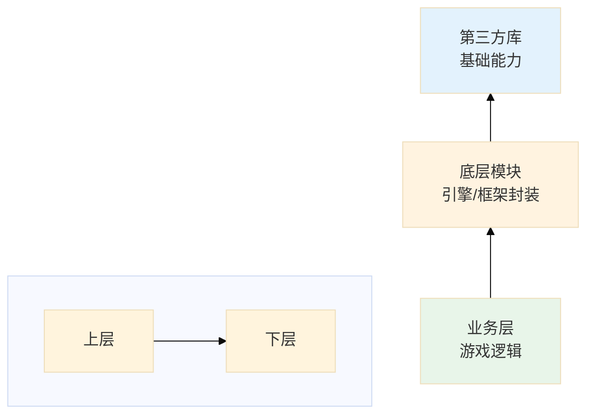

执行项目整体代码扫描，识别模块分布并生成项目结构文档。

**定位：宏观概览。** 关注"有哪些模块、它们属于哪一层"，不深入分析模块内部的类关系和依赖细节。
如需深入分析某个模块的内部结构、依赖和流程，请使用 `module-analyzer`。

## 工作流程

1. **扫描项目结构**
   - 用 `Glob` 遍历目录树（遵循 `.claudeignore` 忽略规则）
   - 识别目录类型（第三方/底层/业务）
   - 用 `Bash(wc -l ...)` 统计代码量，用 `Glob` 统计语言分布

2. **加载领域知识**
   - 读取 `${CLAUDE_PLUGIN_ROOT}/docs/game-glossary.md`，用于第三方库识别和模块功能分类

3. **模块识别与分类**

   **第三方库识别**：
   - 扫描 `third_party/`、`external/`、`libs/`、`vendor/` 等目录
   - 识别开源许可证文件（LICENSE、COPYING）
   - 参照 `game-glossary.md` 中间件列表，将 Wwise、FMOD、Spine 等识别为对应类别

   **底层模块识别**：
   - 被业务模块依赖但很少依赖业务模块
   - 提供通用能力（渲染、网络、音频、资源管理等）
   - 目录内语言一致、功能内聚

   **业务模块识别**：
   - 参照 `game-glossary.md` 目录命名映射表，将目录名映射到功能分类
   - 场景内业务：战斗、探索等（与场景绑定）
   - 场景无关业务：背包、强化等（UI交互）

4. **引擎级关键流程概览**（如能识别）
   - 用 `Grep` 搜索程序入口（main 函数、入口注解等），梳理初始化顺序
   - 识别主循环/帧更新结构（Update、Tick 等），概述每帧执行阶段
   - 不做深入调用链追踪，仅展示宏观执行框架

5. **生成项目概览文档**
   - 输出到指定的 `output_file`
   - 包含模块分布图、层级关系图
   - 依赖关系仅展示**模块间的宏观依赖方向**（如"业务层 → 底层模块 → 第三方库"），不深入文件级依赖

6. **生成架构健康度快照**
   - 基于前述分析结果，评估各健康度维度
   - 识别循环依赖、过度耦合、God Class 等问题
   - 输出第6章"架构健康度快照"，包含健康度总览、详细发现

## 模块识别规则

### 内聚性判断
- 目录下语言一致、功能相关 → 视为一个模块
- `utils` 处理：不单独作为模块，归入父模块分析
- 混合语言：单个模块内不应混合语言，如遇则视为多个模块
- 大型模块：初审识别为粗粒度模块，内部子模块后续分析

### 第三方库（Third-Party）

识别特征：
- 位于 `third_party/`、`external/`、`libs/`、`vendor/` 等目录
- 包含开源许可证文件（LICENSE、COPYING）
- 版本号文件或变更日志

### 底层模块（Core/Infra Modules）

识别特征：
- 被业务模块依赖但很少依赖业务模块
- 提供通用能力（渲染、网络、音频、资源管理等）
- 目录内语言一致、功能内聚

### 业务模块（Business Modules）

识别特征：
- 实现具体游戏功能（战斗、背包、任务等）
- 依赖底层模块提供的能力
- 代码量大、逻辑复杂

**业务类型划分**：
- **场景内业务**：玩家进入场景后的玩法（战斗、探索等）
- **场景无关业务**：包裹操作、道具强化、社交等

## 输出文档结构

```markdown
# 项目整体结构分析

> [返回 Manifest](./manifest.md)

## 导航

| 章节 | 链接 |
|------|------|
| 项目概览 | [#1-项目概览](#1-项目概览) |
| 模块分布 | [#2-模块分布](#2-模块分布) |
| 模块层级图 | [#3-模块层级图](#3-模块层级图) |
| 宏观依赖方向 | [#4-宏观依赖方向](#4-宏观依赖方向) |
| 引擎级流程概览 | [#5-引擎级流程概览](#5-引擎级流程概览) |
| 架构健康度 | [#6-架构健康度快照](#6-架构健康度快照) |
| 后续建议 | [#7-后续分析建议](#7-后续分析建议) |

## 1. 项目概览

| 属性 | 值 |
|------|-----|
| 扫描路径 | {scope} |
| 目录总数 | x |
| 代码文件数 | x |
| 代码行数 | x |
| 主要语言 | {language} |
| 忽略规则文件 | `.claudeignore` (如存在) |

[↑ 返回导航](#导航)

## 2. 模块分布

### 2.1 第三方库
| 序号 | 名称 | 路径 | 语言 | 说明 |
|------|------|------|------|------|
| 1 | {库名} | `path` | C++ | ... |

### 2.2 底层模块
| 序号 | 名称 | 路径 | 类型 | 说明 |
|------|------|------|------|------|
| 1 | {模块名} | `path` | 渲染 | ... |

### 2.3 业务模块
| 类型 | 模块 | 路径 |
|------|------|------|
| 场景内 | 战斗 | `path` |
| 场景无关 | 背包 | `path` |

[↑ 返回导航](#导航)

## 3. 模块层级图

```mermaid
%%{init: {'theme': 'base', 'themeVariables': { 'primaryColor': '#e1f5fe' }, 'flowchart': { 'useMaxWidth': true, 'htmlLabels': true, 'curve': 'basis' }}}%%
graph TD
    BIZ[业务层] --> BIZ_SCENE[场景内业务<br/>战斗、探索]
    BIZ --> BIZ_UI[场景无关业务<br/>背包、强化]

    CORE[底层模块] --> Render[渲染模块]
    CORE --> Network[网络模块]
    CORE --> Resource[资源管理]

    LIB[第三方库] --> ExtDeps[所有外部依赖]

    %% 增加节点间距优化高度显示
    subgraph 业务层[""]
        BIZ
    end
    subgraph 底层[""]
        CORE
    end
    subgraph 第三方[""]
        LIB
    end
```

[↑ 返回导航](#导航)

## 4. 宏观依赖方向

**箭头语义：`A --> B` 表示 "A 依赖于 B"（上层依赖下层）**

展示模块层级间的依赖方向（不深入文件级依赖，详细依赖分析见 module 类型）：



**分层说明：**
- 业务层（上层）依赖于底层模块提供的通用能力
- 底层模块（中层）依赖于第三方库（下层）的基础功能

[↑ 返回导航](#导航)

## 5. 引擎级流程概览

> 如能识别程序入口和主循环，在此展示宏观执行框架。否则可省略本章节。

### 5.1 初始化顺序

| 顺序 | 模块 | 入口函数 | 说明 |
|------|------|----------|------|
| 1 | {模块名} | `Func()` | 描述 |

### 5.2 主循环框架

```mermaid
%%{init: {'theme': 'base', 'flowchart': { 'useMaxWidth': true, 'padding': 20 }}}%%
graph TD
    FrameStart[帧开始] --> Phase1[阶段1]
    Phase1 --> Phase2[阶段2]
    Phase2 --> PhaseN[阶段N]
    PhaseN --> FrameEnd[帧结束]

    %% 增加垂直间距优化显示
    subgraph 单帧流程[""]
        FrameStart
        Phase1
        Phase2
        PhaseN
        FrameEnd
    end
```

[↑ 返回导航](#导航)

## 6. 架构健康度快照

基于项目整体扫描结果，快速评估架构健康状况。

### 6.1 健康度总览

| 维度 | 状态 | 得分 | 数据来源 |
|------|------|------|----------|
| 模块耦合 | 🟢/🟡/🔴 | 85/100 | 宏观依赖方向分析 |
| 代码规模 | 🟢/🟡/🔴 | 90/100 | 模块分布统计 |
| 目录组织 | 🟢/🟡/🔴 | 88/100 | 模块层级图评估 |
| 依赖方向 | 🟢/🟡/🔴 | 92/100 | 分层结构合理性 |
| 技术债务 | 🟢/🟡/🔴 | 75/100 | God Class 检测 |

**综合健康度: 86/100** (优秀/良好/需关注/高风险)

### 6.2 详细发现

#### 模块耦合问题

| 问题类型 | 涉及模块 | 说明 | 建议 |
|----------|----------|------|------|
| 循环依赖 | A ↔ B | 模块A和B相互依赖 | 提取公共接口 |
| 过度耦合 | C被15+模块依赖 | 变更影响范围大 | 拆分为细粒度模块 |
| 越层依赖 | 业务层→第三方库 | 跳过底层抽象 | 增加适配层 |

#### 代码规模分布

| 模块类别 | 模块数 | 总行数 | 平均行数 | 评估 |
|----------|--------|--------|----------|------|
| 底层模块 | X | Y | Z | 适中/偏大 |
| 业务模块 | X | Y | Z | 适中/建议拆分 |

#### 技术债务检测

| 类型 | 数量 | 位置示例 | 风险等级 |
|------|------|----------|----------|
| God Class | N | `Core/GameManager.cs` | 高 |
| 过长文件 | N | `Battle/BattleSystem.cs` | 中 |

[↑ 返回导航](#导航)

## 7. 后续分析建议

| 模块 | 建议命令 |
|------|---------|
| 渲染模块 | `/code-analyzer {path} module` |
| 网络模块 | `/code-analyzer {path} module` |
| ... | ... |

---
*生成时间: {YYYY-MM-DD HH:MM}*

[↑ 返回导航](#导航)
```
