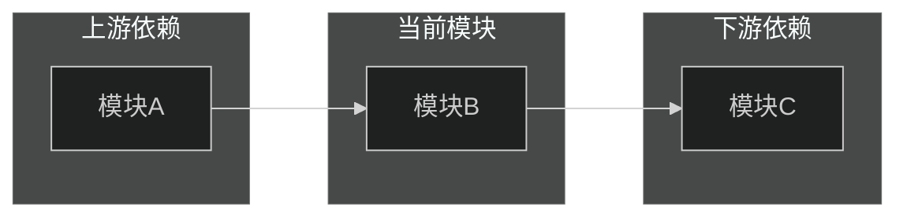
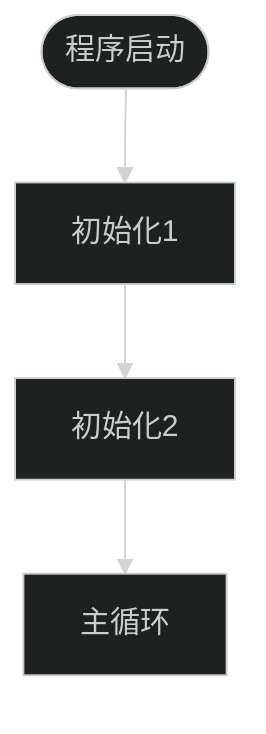

执行项目整体代码扫描，识别模块分布并生成项目结构文档。

**定位：宏观概览。** 关注"有哪些模块、它们属于哪一层"，不深入分析模块内部的类关系和依赖细节。
如需深入分析某个模块的内部结构、依赖和流程，请使用 `module-analyzer`。

## 输入参数

本 Skill 接收以下参数（由 analyst agent 传递）：

| 参数 | 类型 | 必填 | 说明 |
|------|------|------|------|
| `scope` | string | 是 | 扫描路径，通常为 `.` 表示项目根目录 |
| `output_file` | string | 是 | 输出文件路径，由调用方指定 |

## 工作流程

1. **扫描项目结构**
   - 用 `Glob` 遍历目录树（遵循 `.claudeignore` 忽略规则）
   - 识别目录类型（第三方/底层/业务）
   - 用 `Bash(wc -l ...)` 统计代码量，用 `Glob` 统计语言分布

2. **加载领域知识**
   - 读取 `${CLAUDE_PLUGIN_ROOT}/docs/game-glossary.md`，用于第三方库识别和模块功能分类

3. **模块识别与分类**

   **第三方库识别**：
   - 扫描 `third_party/`、`external/`、`libs/`、`vendor/` 等目录
   - 识别开源许可证文件（LICENSE、COPYING）
   - 参照 `game-glossary.md` 中间件列表，将 Wwise、FMOD、Spine 等识别为对应类别

   **底层模块识别**：
   - 被业务模块依赖但很少依赖业务模块
   - 提供通用能力（渲染、网络、音频、资源管理等）
   - 目录内语言一致、功能内聚

   **业务模块识别**：
   - 参照 `game-glossary.md` 目录命名映射表，将目录名映射到功能分类
   - 场景内业务：战斗、探索等（与场景绑定）
   - 场景无关业务：背包、强化等（UI交互）

4. **引擎级关键流程概览**（如能识别）
   - 用 `Grep` 搜索程序入口（main 函数、入口注解等），梳理初始化顺序
   - 识别主循环/帧更新结构（Update、Tick 等），概述每帧执行阶段
   - 不做深入调用链追踪，仅展示宏观执行框架

5. **汇总架构健康度评估**
   - 基于前述分析结果，评估各健康度维度
   - 识别循环依赖、过度耦合、God Class 等问题
   - 使用 🟢🟡🔴 统计问题严重程度
   - 准备架构健康度快照

6. **生成分析报告（强制执行）**

   **警告**：必须严格遵循以下模板结构，不得自由发挥。任何偏离模板的行为都是错误的。

   要求：
   - 必须使用 Write 工具将完整文档写入 `output_file`
   - 必须包含完整的 frontmatter（YAML 头部）
   - 必须包含导航表格和章节间导航链接
   - 必须严格按照模板的 7 个章节顺序输出
   - 代码链接必须使用 `[📄 描述](路径#L行号)` 格式
   - 状态指示必须使用 🟢🟡🔴

   模板如下（复制此结构，填充内容）：

```markdown
---
name: root-full-scan
description: |
  {一句话描述分析内容}
---

# {项目名} 整体结构分析

> [返回 Manifest](./manifest.md)

## 导航

| 章节 | 链接 | 快速跳转 |
|------|------|----------|
| 1. 项目概览 | [#1-项目概览](#1-项目概览) | 代码统计、语言分布 |
| 2. 模块分布 | [#2-模块分布](#2-模块分布) | 第三方库、底层、业务模块 |
| 3. 模块层级图 | [#3-模块层级图](#3-模块层级图) | Mermaid 图表 |
| 4. 宏观依赖方向 | [#4-宏观依赖方向](#4-宏观依赖方向) | 模块间依赖关系 |
| 5. 引擎级流程概览 | [#5-引擎级流程概览](#5-引擎级流程概览) | 初始化、主循环 |
| 6. 架构健康度快照 | [#6-架构健康度快照](#6-架构健康度快照) | 🟢🟡🔴 评估 |
| 7. 后续分析建议 | [#7-后续分析建议](#7-后续分析建议) | 下一步分析方向 |

---

## 1. 项目概览

### 1.1 代码统计

| 指标 | 数值 |
|------|------|
| 总代码行数 | {行数} |
| 代码文件数 | {文件数} |
| 模块数 | {模块数} |

### 1.2 语言分布

| 语言 | 文件数 | 占比 |
|------|--------|------|
| {语言1} | {数量} | {百分比} |
| {语言2} | {数量} | {百分比} |

**[↑ 返回顶部](#导航)** | **[→ 下一章：模块分布](#2-模块分布)**

---

## 2. 模块分布

### 2.1 第三方库

| 库名 | 路径 | 用途 | 许可证 |
|------|------|------|--------|
| {库名} | {路径} | {用途} | {许可证} |

### 2.2 底层模块

| 模块名 | 路径 | 职责 | 代码规模 |
|--------|------|------|----------|
| {模块名} | {路径} | {职责} | {行数} |

### 2.3 业务模块

| 模块名 | 路径 | 功能分类 | 场景绑定 | 代码规模 |
|--------|------|----------|----------|----------|
| {模块名} | {路径} | {分类} | {是/否} | {行数} |

**[↑ 返回顶部](#导航)** | **[← 上一章：项目概览](#1-项目概览)** | **[→ 下一章：模块层级图](#3-模块层级图)**

---

## 3. 模块层级图

```mermaid
%%{init: {'theme': 'dark', 'flowchart': { 'useMaxWidth': true, 'htmlLabels': true, 'curve': 'basis' }}}%%
graph TD
    subgraph 第三方库["🔌 第三方库"]
        third1[{库1}]
        third2[{库2}]
    end

    subgraph 底层模块["🔧 底层模块"]
        infra1[{模块1}]
        infra2[{模块2}]
    end

    subgraph 业务模块["🎮 业务模块"]
        biz1[{业务1}]
        biz2[{业务2}]
    end

    third1 --> infra1
    infra1 --> biz1
    infra2 --> biz2
```

**[↑ 返回顶部](#导航)** | **[← 上一章：模块分布](#2-模块分布)** | **[→ 下一章：宏观依赖方向](#4-宏观依赖方向)**

---

## 4. 宏观依赖方向



| 模块 | 上游依赖 | 下游依赖 |
|------|----------|----------|
| {模块名} | {上游列表} | {下游列表} |

**[↑ 返回顶部](#导航)** | **[← 上一章：模块层级图](#3-模块层级图)** | **[→ 下一章：引擎级流程概览](#5-引擎级流程概览)**

---

## 5. 引擎级流程概览

### 5.1 初始化流程



### 5.2 主循环结构

| 阶段 | 说明 |
|------|------|
| {阶段1} | {说明} |
| {阶段2} | {说明} |

**[↑ 返回顶部](#导航)** | **[← 上一章：宏观依赖方向](#4-宏观依赖方向)** | **[→ 下一章：架构健康度快照](#6-架构健康度快照)**

---

## 6. 架构健康度快照

| 维度 | 评分 | 说明 |
|------|------|------|
| 模块划分清晰度 | 🟢🟡🔴 | {说明} |
| 依赖合理性 | 🟢🟡🔴 | {说明} |
| 耦合度控制 | 🟢🟡🔴 | {说明} |
| 扩展性 | 🟢🟡🔴 | {说明} |

### 发现的问题

| 问题 | 严重程度 | 位置 | 建议 |
|------|----------|------|------|
| {问题描述} | 🔴 | {位置} | {建议} |

**[↑ 返回顶部](#导航)** | **[← 上一章：引擎级流程概览](#5-引擎级流程概览)** | **[→ 下一章：后续分析建议](#7-后续分析建议)**

---

## 7. 后续分析建议

基于整体扫描结果，建议优先进行以下深度分析：

| 优先级 | 模块/功能 | 分析类型 | 理由 |
|--------|-----------|----------|------|
| {P0/P1/P2} | {模块名} | {module/feature} | {理由} |

---

**文档导航**：[返回顶部](#导航) | [返回 Manifest](./manifest.md)

*生成时间: {YYYY-MM-DD HH:MM}*
```

   - 使用 Write 工具将完整文档写入 `output_file`
