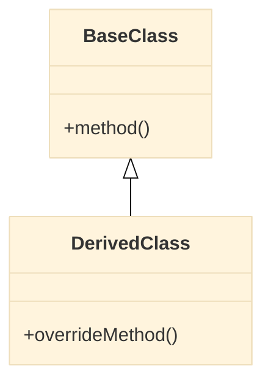
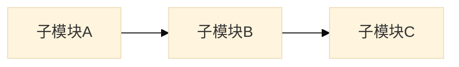
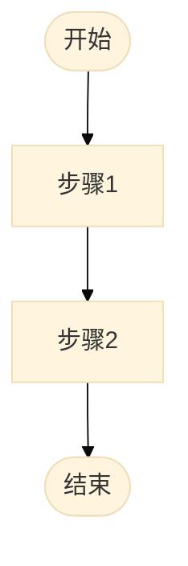

对指定模块执行结构 + 流程的综合深度分析，一次输出完整的模块画像。

**定位：模块级深度分析。** 深入模块内部，识别子模块边界、类关系、依赖网络和关键业务流程。
与 `full-scan` 的区别：`full-scan` 是项目级宏观概览（模块分布和层级），本 Skill 深入单个模块内部做详细分析。

## 输入参数

本 Skill 接收以下参数（由 analyst agent 传递）：

| 参数 | 类型 | 必填 | 说明 |
|------|------|------|------|
| `scope` | string | 是 | 要分析的模块路径（如 `./src/battle`） |
| `output_file` | string | 是 | 输出文件路径，由调用方指定 |
| `focus` | string | 否 | 用户指定的重点关注事项 |

## 工作流程

1. **加载领域知识**
   - 读取 `${CLAUDE_PLUGIN_ROOT}/docs/game-glossary.md`，辅助理解目录命名、中间件识别和模块功能分类

2. **目录结构分析**
   - 用 `Glob` 扫描目录层级（遵循 `.claudeignore` 忽略规则）
   - 用 `Glob` 识别代码文件分布
   - 参照 `game-glossary.md` 命名映射表理解目录职责
   - 分析命名规范和目录组织

3. **子模块/功能块识别**
   - 按目录或命名空间划分子模块，每个子模块明确：名称、路径、职责、包含的核心文件
   - 参照 `game-glossary.md` 目录命名映射确定功能分类
   - 无子目录的扁平模块：按文件命名前缀或类职责聚合为功能块
   - 输出子模块列表和职责摘要

4. **类/接口关系分析**
   - 识别主要类和接口
   - 分析继承关系，用 `classDiagram` 图呈现
   - 分析组合/聚合关系，用 `classDiagram` 图呈现

5. **子模块依赖分析**
   - 用 `Grep` 分析文件间的 include/import 关系
   - 将文件级依赖**归集到子模块粒度**，生成子模块间依赖图（`graph LR`）
   - 识别循环依赖、过度耦合
   - 评估各子模块的内聚性和耦合度

6. **外部模块关系分析**
   - 用 `Grep` 在**当前分析范围之外**搜索对本模块的 include/import 引用，确定哪些外部模块依赖本模块
   - 分析本模块代码中引用的外部模块（scope 之外的路径）
   - 如有 `full-scan` 文档，参照其模块分布表将路径映射为模块名
   - 生成本模块的外部关系图（`graph LR`），展示上下游依赖

7. **关键流程分析**
   - 根据模块类型（参照 `game-glossary.md` 判断），选择合适的分析重点：
     - **引擎/底层模块**：初始化链、更新循环、资源生命周期
     - **网络模块**：发包/收包流程、状态同步机制
     - **业务模块**：业务入口、核心业务流程、与底层模块的交互
   - 用 `Grep` 识别入口函数，用 `Read` + `Grep` 追踪调用链
   - 用 `graph TD` 呈现关键流程

8. **汇总架构健康度评估**
   - 汇总第1-7章的分析结果
   - 按照以下维度评估模块质量：目录组织、子模块划分、类设计、依赖管理、流程清晰度、健壮性
   - 使用 🟢🟡🔴 统计各维度问题严重程度（高/中/低）
   - 准备架构健康度快照

9. **生成分析报告**
   - 按以下模板结构生成文档，使用 Write 工具写入 `output_file`：

```markdown
---
name: {模块名}-module
description: |
  {一句话描述模块职责}
---

# {模块名} 模块分析

> [返回 Manifest](./manifest.md) | [返回 full-scan](./root-full-scan.md)

## 导航

| 章节 | 链接 | 快速跳转 |
|------|------|----------|
| 1. 模块概述 | [#1-模块概述](#1-模块概述) | 职责、定位、规模 |
| 2. 目录结构 | [#2-目录结构](#2-目录结构) | 目录树、组织分析 |
| 3. 核心类关系 | [#3-核心类关系](#3-核心类关系) | 继承、组合关系图 |
| 4. 内部依赖 | [#4-内部依赖](#4-内部依赖) | 子模块依赖图 |
| 5. 外部关系 | [#5-外部关系](#5-外部关系) | 上下游依赖 |
| 6. 关键流程 | [#6-关键流程](#6-关键流程) | 核心业务流程 |
| 7. 架构健康度 | [#7-架构健康度](#7-架构健康度) | 🟢🟡🔴 评估 |

---

## 1. 模块概述

### 1.1 基本信息

| 属性 | 值 |
|------|-----|
| 模块路径 | `{scope}` |
| 代码规模 | {行数} |
| 文件数量 | {文件数} |
| 核心职责 | {职责描述} |

### 1.2 在系统中的定位

{描述模块在整体架构中的位置，与周边模块的关系}

**[↑ 返回顶部](#导航)** | **[→ 下一章：目录结构](#2-目录结构)**

---

## 2. 目录结构

```
{模块路径}
├── {subdir1}/
│   ├── {file1}
│   └── {file2}
├── {subdir2}/
│   └── ...
└── ...
```

### 2.1 目录组织分析

| 目录 | 职责 | 评价 |
|------|------|------|
| {目录名} | {职责} | 🟢🟡🔴 {说明} |

**[↑ 返回顶部](#导航)** | **[← 上一章：模块概述](#1-模块概述)** | **[→ 下一章：核心类关系](#3-核心类关系)**

---

## 3. 核心类关系

### 3.1 类图



### 3.2 类职责表

| 类名 | 职责 | 代码链接 |
|------|------|----------|
| {类名} | {职责} | [`📄 定义`]({路径}#L{行号}) |

**[↑ 返回顶部](#导航)** | **[← 上一章：目录结构](#2-目录结构)** | **[→ 下一章：内部依赖](#4-内部依赖)**

---

## 4. 内部依赖

### 4.1 子模块依赖图



### 4.2 依赖矩阵

| 子模块 | 被谁依赖 | 依赖谁 | 内聚度 |
|--------|----------|--------|--------|
| {子模块} | {列表} | {列表} | 🟢🟡🔴 |

**[↑ 返回顶部](#导航)** | **[← 上一章：核心类关系](#3-核心类关系)** | **[→ 下一章：外部关系](#5-外部关系)**

---

## 5. 外部关系

### 5.1 上游依赖（谁依赖我）

| 模块 | 引用位置 | 用途 |
|------|----------|------|
| {模块名} | [`📄`]({路径}#L{行号}) | {用途} |

### 5.2 下游依赖（我依赖谁）

| 模块 | 被引用位置 | 用途 |
|------|------------|------|
| {模块名} | [`📄`]({路径}#L{行号}) | {用途} |

### 5.3 外部关系图

```mermaid
%%{init: {'theme': 'base', 'flowchart': { 'useMaxWidth': true, 'htmlLabels': true, 'curve': 'basis' }}}%%
graph LR
    subgraph 上游
        A[模块A]
    end
    subgraph 本模块
        B[{模块名}]
    end
    subgraph 下游
        C[模块C]
    end
    A --> B --> C
```

**[↑ 返回顶部](#导航)** | **[← 上一章：内部依赖](#4-内部依赖)** | **[→ 下一章：关键流程](#6-关键流程)**

---

## 6. 关键流程

### 6.1 {流程名称}



| 步骤 | 函数/类 | 职责 | 代码链接 |
|------|---------|------|----------|
| 1 | {函数名} | {职责} | [`📄`]({路径}#L{行号}) |

**[↑ 返回顶部](#导航)** | **[← 上一章：外部关系](#5-外部关系)** | **[→ 下一章：架构健康度](#7-架构健康度)**

---

## 7. 架构健康度

### 7.1 各维度评估

| 维度 | 评分 | 说明 |
|------|------|------|
| 目录组织 | 🟢🟡🔴 | {说明} |
| 子模块划分 | 🟢🟡🔴 | {说明} |
| 类设计 | 🟢🟡🔴 | {说明} |
| 依赖管理 | 🟢🟡🔴 | {说明} |
| 流程清晰度 | 🟢🟡🔴 | {说明} |
| 健壮性 | 🟢🟡🔴 | {说明} |

### 7.2 发现的问题

| 问题 | 严重程度 | 位置 | 建议 |
|------|----------|------|------|
| {问题描述} | 🔴 | {位置} | {建议} |

### 7.3 优点总结

- {优点1}
- {优点2}

**[↑ 返回顶部](#导航)** | **[← 上一章：关键流程](#6-关键流程)**

---

**文档导航**：[返回顶部](#导航) | [返回 Manifest](./manifest.md) | [返回 full-scan](./root-full-scan.md)

*生成时间: {YYYY-MM-DD HH:MM}*
```

   - 使用 Write 工具将完整文档写入 `output_file`
