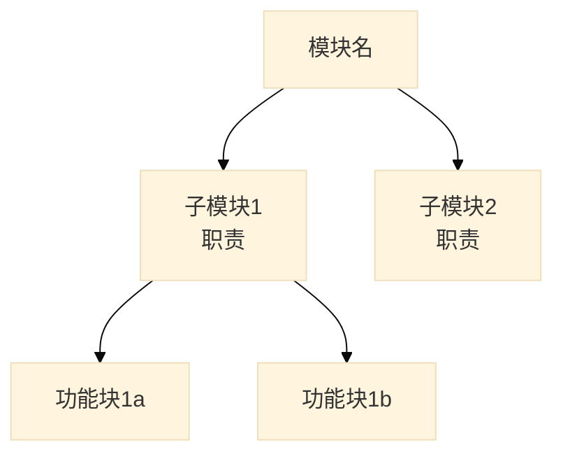
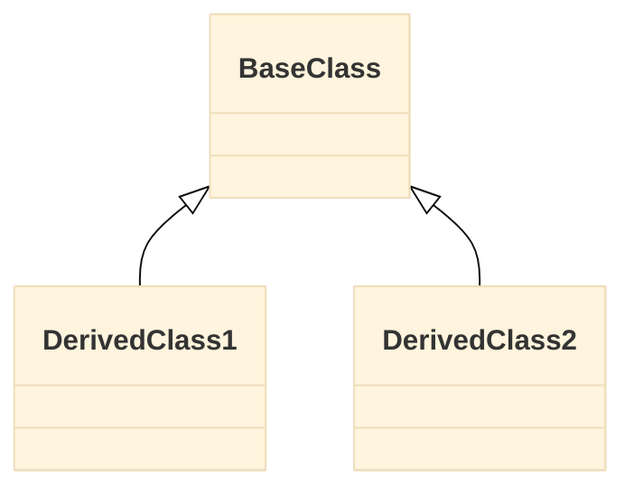
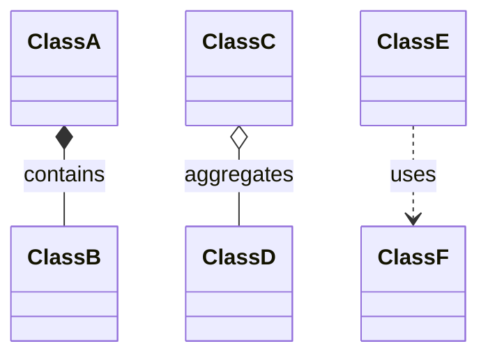
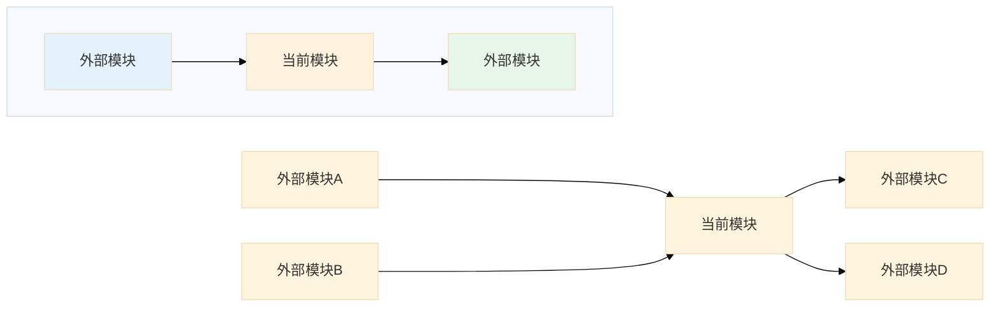
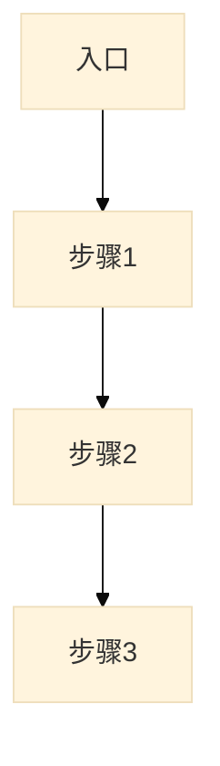

对指定模块执行结构 + 流程的综合深度分析，一次输出完整的模块画像。

**定位：模块级深度分析。** 深入模块内部，识别子模块边界、类关系、依赖网络和关键业务流程。
与 `full-scan` 的区别：`full-scan` 是项目级宏观概览（模块分布和层级），本 Skill 深入单个模块内部做详细分析。

## 工作流程

1. **加载领域知识**
   - 读取 `${CLAUDE_PLUGIN_ROOT}/docs/game-glossary.md`，辅助理解目录命名、中间件识别和模块功能分类

2. **目录结构分析**
   - 用 `Glob` 扫描目录层级（遵循 `.claudeignore` 忽略规则）
   - 用 `Glob` 识别代码文件分布
   - 参照 `game-glossary.md` 命名映射表理解目录职责
   - 分析命名规范和目录组织

3. **子模块/功能块识别**
   - 按目录或命名空间划分子模块，每个子模块明确：名称、路径、职责、包含的核心文件
   - 参照 `game-glossary.md` 目录命名映射确定功能分类
   - 无子目录的扁平模块：按文件命名前缀或类职责聚合为功能块
   - 输出子模块列表和职责摘要

4. **类/接口关系分析**
   - 识别主要类和接口
   - 分析继承关系，用 `classDiagram` 图呈现
   - 分析组合/聚合关系，用 `classDiagram` 图呈现

5. **子模块依赖分析**
   - 用 `Grep` 分析文件间的 include/import 关系
   - 将文件级依赖**归集到子模块粒度**，生成子模块间依赖图（`graph LR`）
   - 识别循环依赖、过度耦合
   - 评估各子模块的内聚性和耦合度

6. **外部模块关系分析**
   - 用 `Grep` 在**当前分析范围之外**搜索对本模块的 include/import 引用，确定哪些外部模块依赖本模块
   - 分析本模块代码中引用的外部模块（scope 之外的路径）
   - 如有 `full-scan` 文档，参照其模块分布表将路径映射为模块名
   - 生成本模块的外部关系图（`graph LR`），展示上下游依赖

7. **关键流程分析**
   - 根据模块类型（参照 `game-glossary.md` 判断），选择合适的分析重点：
     - **引擎/底层模块**：初始化链、更新循环、资源生命周期
     - **网络模块**：发包/收包流程、状态同步机制
     - **业务模块**：业务入口、核心业务流程、与底层模块的交互
   - 用 `Grep` 识别入口函数，用 `Read` + `Grep` 追踪调用链
   - 用 `graph TD` 呈现关键流程

8. **生成分析报告**
   - 输出到指定的 `output_file`
   - **所有关系图、依赖图、流程图必须使用 Mermaid 语法**（`classDiagram` / `graph TD` / `graph LR`），禁止 ASCII 文本图

9. **生成架构健康度快照**
   - 汇总第1-6章的分析结果
   - 评估目录组织、类设计、依赖管理、流程清晰度等维度
   - 统计问题严重程度（高/中/低）
   - 输出第7章"架构健康度快照"，包含健康度总览和关键问题摘要

## 额外评分维度

模块分析在通用维度基础上，额外评估：

| 维度 | 评估要点 |
|------|----------|
| **目录组织** | 层级深度、职责分离、命名规范 |
| **子模块划分** | 边界清晰、职责单一、粒度合理 |
| **类设计** | 单一职责、继承合理、接口清晰 |
| **依赖管理** | 无循环依赖、依赖方向正确、耦合度低 |
| **流程清晰度** | 步骤明确、职责分离、易于追踪 |
| **健壮性** | 错误处理、状态恢复、边界处理 |

## 输出文档结构

```markdown
# 模块深度分析

> [返回 Manifest](./manifest.md)

## 导航

| 章节 | 链接 |
|------|------|
| 目录结构 | [#1-目录结构](#1-目录结构) |
| 子模块/功能块 | [#2-子模块功能块](#2-子模块功能块) |
| 类关系图 | [#3-类关系图](#3-类关系图) |
| 内部依赖 | [#4-内部依赖](#4-内部依赖) |
| 外部关系 | [#5-外部关系](#5-外部关系) |
| 关键流程 | [#6-关键流程](#6-关键流程) |
| 架构健康度 | [#7-架构健康度快照](#7-架构健康度快照) |
| 问题与建议 | [#8-问题与建议](#8-问题与建议) |

## 1. 目录结构

### 1.1 整体概览

```
[目录树结构]
```

### 1.2 目录组织评估

| 目录 | 文件数 | 职责 | 清晰度 | 建议 |
|------|--------|------|--------|------|
| {dir} | x | 描述 | 清晰/模糊 | ... |

[↑ 返回导航](#导航)

## 2. 子模块/功能块

### 2.1 子模块列表

| 序号 | 名称 | 路径 | 职责 | 核心文件 | 代码行数 |
|------|------|------|------|----------|----------|
| 1 | {子模块名} | `path` | 职责描述 | `File1.cs`, `File2.cs` | x |

### 2.2 子模块层级图



[↑ 返回导航](#导航)

## 3. 类关系图

### 3.1 核心类列表

| 类名 | 所属子模块 | 职责 | 代码链接 |
|------|-----------|------|----------|
| `{Class}` | {子模块名} | 职责 | `[定义](path:line)` |

### 3.2 继承关系



### 3.3 组合/聚合关系



[↑ 返回导航](#导航)

## 4. 内部依赖

### 4.1 子模块依赖图


### 4.2 依赖矩阵

| 子模块 | 被依赖 | 依赖其他 | 内聚度 | 耦合度 |
|--------|--------|----------|--------|--------|
| {子模块名} | x 个 | y 个 | 高/中/低 | 高/中/低 |

### 4.3 问题依赖

| 问题类型 | 涉及模块 | 说明 | 建议 |
|----------|----------|------|------|
| 循环依赖 | A ↔ B | 说明 | 建议 |
| 过度耦合 | C → D,E,F... | 说明 | 建议 |

[↑ 返回导航](#导航)

## 5. 外部关系

### 5.1 外部关系图

**箭头语义：`A --> B` 表示 "A 依赖于 B"（A 使用 B）**



### 5.2 被谁依赖（上游）

> 上游模块引用当前模块（箭头指向当前模块）

| 外部模块 | 引用方式 | 引用的子模块/类 | 说明 |
|----------|----------|----------------|------|
| {模块名} | include/import | `{Class}` | 用途描述 |

### 5.3 依赖谁（下游）

> 当前模块引用外部模块（箭头从当前模块指出）

| 外部模块 | 引用方式 | 本模块引用点 | 说明 |
|----------|----------|-------------|------|
| {模块名} | include/import | `{文件:行}` | 用途描述 |

[↑ 返回导航](#导航)

## 6. 关键流程

### 6.1 流程概览

| 流程名称 | 入口函数 | 类型 | 说明 |
|----------|----------|------|------|
| {流程名} | `Func()` | 初始化/更新/业务 | 简要描述 |

### 6.2 流程详情

> 以下为各关键流程的调用链和说明。根据模块类型，展示最相关的流程。

#### 流程 1：{流程名称}



| 步骤 | 函数 | 职责 | 代码链接 |
|------|------|------|----------|
| 1 | `Func1()` | 描述 | `[代码](path:line)` |
| 2 | `Func2()` | 描述 | `[代码](path:line)` |

#### 流程 2：{流程名称}

（同上格式，按需重复）

[↑ 返回导航](#导航)

## 7. 架构健康度快照

基于前述分析，汇总模块级架构健康度评估。

### 7.1 健康度总览

| 维度 | 状态 | 得分 | 数据来源 |
|------|------|------|----------|
| 目录组织 | 🟢/🟡/🔴 | 85/100 | 第1章目录组织评估 |
| 子模块内聚 | 🟢/🟡/🔴 | 80/100 | 第2章子模块划分 |
| 类设计 | 🟢/🟡/🔴 | 70/100 | 第3章类关系分析 |
| 依赖管理 | 🟢/🟡/🔴 | 75/100 | 第4章内部依赖矩阵 |
| 流程清晰度 | 🟢/🟡/🔴 | 88/100 | 第6章关键流程 |
| 技术债务 | 🟢/🟡/🔴 | 65/100 | 第8章问题汇总 |

**综合健康度: 77/100** (优秀/良好/需关注/高风险)

### 7.2 关键问题摘要

| 严重程度 | 数量 | 主要问题 |
|---------|------|----------|
| 高 | N | 如：God Class、严重循环依赖 |
| 中 | N | 如：过度耦合、职责模糊 |
| 低 | N | 如：命名不一致、目录层级偏深 |

[↑ 返回导航](#导航)

## 8. 问题与建议

### 8.1 结构与流程问题

| 严重程度 | 类别 | 问题 | 位置 | 建议 |
|---------|------|------|------|------|
| 高/中/低 | 目录/类设计/依赖/流程 | 描述 | `[位置](path:line)` | 建议 |

### 8.2 改进建议

| 优先级 | 建议 | 涉及子模块 | 预期收益 |
|--------|------|-----------|----------|
| 高/中/低 | 描述 | {子模块名} | 收益描述 |

---
*生成时间: {YYYY-MM-DD HH:MM}*

[↑ 返回导航](#导航)
```
