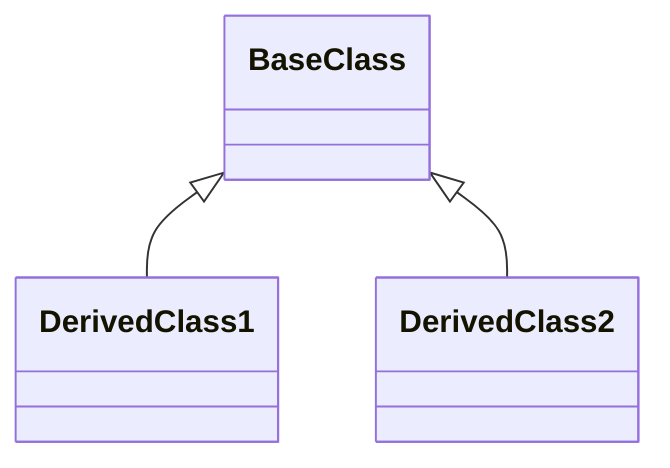
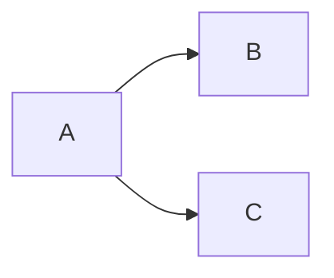
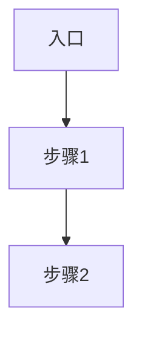

对指定模块执行结构 + 流程的综合深度分析，一次输出完整的模块画像。

**定位：模块级深度分析。** 深入模块内部，识别子模块边界、类关系、依赖网络和关键业务流程。
与 `full-scan` 的区别：`full-scan` 是项目级宏观概览（模块分布和层级），本 Skill 深入单个模块内部做详细分析。

## 工作流程

1. **加载领域知识**
   - 读取 `${CLAUDE_PLUGIN_ROOT}/docs/game-glossary.md`，辅助理解目录命名、中间件识别和模块功能分类

2. **目录结构分析**
   - 用 `Glob` 扫描目录层级（遵循 `.claudeignore` 忽略规则）
   - 用 `Glob` 识别代码文件分布
   - 参照 `game-glossary.md` 命名映射表理解目录职责
   - 分析命名规范和目录组织

3. **子模块/功能块识别**
   - 按目录或命名空间划分子模块，每个子模块明确：名称、路径、职责、包含的核心文件
   - 参照 `game-glossary.md` 目录命名映射确定功能分类
   - 无子目录的扁平模块：按文件命名前缀或类职责聚合为功能块
   - 输出子模块列表和职责摘要

4. **类/接口关系分析**
   - 识别主要类和接口
   - 分析继承关系，用 `classDiagram` 图呈现
   - 分析组合/聚合关系，用 `classDiagram` 图呈现

5. **子模块依赖分析**
   - 用 `Grep` 分析文件间的 include/import 关系
   - 将文件级依赖**归集到子模块粒度**，生成子模块间依赖图（`graph LR`）
   - 识别循环依赖、过度耦合
   - 评估各子模块的内聚性和耦合度

6. **外部模块关系分析**
   - 用 `Grep` 在**当前分析范围之外**搜索对本模块的 include/import 引用，确定哪些外部模块依赖本模块
   - 分析本模块代码中引用的外部模块（scope 之外的路径）
   - 如有 `full-scan` 文档，参照其模块分布表将路径映射为模块名
   - 生成本模块的外部关系图（`graph LR`），展示上下游依赖

7. **关键流程分析**
   - 根据模块类型（参照 `game-glossary.md` 判断），选择合适的分析重点：
     - **引擎/底层模块**：初始化链、更新循环、资源生命周期
     - **网络模块**：发包/收包流程、状态同步机制
     - **业务模块**：业务入口、核心业务流程、与底层模块的交互
   - 用 `Grep` 识别入口函数，用 `Read` + `Grep` 追踪调用链
   - 用 `graph TD` 呈现关键流程

8. **生成分析报告**
   - 输出到指定的 `output_file`
   - **必须包含完整导航**：顶部导航表格、各章节末尾的 `[↑ 返回顶部] | [← 上一章] | [→ 下一章]` 链接、文档末尾导航栏
   - **章节结构**：遵循「输出文档结构」模板，确保章节顺序和导航链接正确对应

9. **生成架构健康度快照**
   - 汇总第1-6章的分析结果
   - 评估目录组织、类设计、依赖管理、流程清晰度等维度
   - 统计问题严重程度（高/中/低）
   - 输出第7章"架构健康度快照"，包含健康度总览和关键问题摘要

## 额外评分维度

模块分析在通用维度基础上，额外评估：

| 维度 | 评估要点 |
|------|----------|
| **目录组织** | 层级深度、职责分离、命名规范 |
| **子模块划分** | 边界清晰、职责单一、粒度合理 |
| **类设计** | 单一职责、继承合理、接口清晰 |
| **依赖管理** | 无循环依赖、依赖方向正确、耦合度低 |
| **流程清晰度** | 步骤明确、职责分离、易于追踪 |
| **健壮性** | 错误处理、状态恢复、边界处理 |

## 输出文档结构

生成文档必须包含顶部导航表格，各章节末尾添加返回顶部和上下章链接。

```markdown
# {模块名} 模块深度分析

> [返回 Manifest](./manifest.md) | [返回 full-scan](./root-full-scan.md)

## 导航

| 章节 | 链接 | 快速跳转 |
|------|------|----------|
| 模块概述 | [#1-模块概述](#1-模块概述) | [↓ 跳转到此章节](#1-模块概述) |
| 目录结构 | [#2-目录结构](#2-目录结构) | [↓ 跳转到此章节](#2-目录结构) |
| 核心类关系 | [#3-核心类关系](#3-核心类关系) | [↓ 跳转到此章节](#3-核心类关系) |
| 内部依赖 | [#4-内部依赖](#4-内部依赖) | [↓ 跳转到此章节](#4-内部依赖) |
| 外部关系 | [#5-外部关系](#5-外部关系) | [↓ 跳转到此章节](#5-外部关系) |
| 关键流程 | [#6-关键流程](#6-关键流程) | [↓ 跳转到此章节](#6-关键流程) |
| 架构健康度 | [#7-架构健康度](#7-架构健康度) | [↓ 跳转到此章节](#7-架构健康度) |

---

## 1. 模块概述

### 1.1 基本信息

| 属性 | 值 |
|------|-----|
| **模块路径** | `{路径}` |
| **文件数量** | x 个 |
| **代码行数** | x 行 |
| **主要语言** | {语言} |
| **核心职责** | 描述 |

### 1.2 架构定位

{模块在整个系统中的定位和职责说明}

**[↑ 返回顶部](#导航)** | **[→ 下一章：目录结构](#2-目录结构)**

## 2. 目录结构

### 2.1 整体概览

```
[目录树结构]
```

### 2.2 目录组织评估

| 目录 | 文件数 | 职责 | 清晰度 | 建议 |
|------|--------|------|--------|------|
| {dir} | x | 描述 | 清晰/模糊 | ... |

**[↑ 返回顶部](#导航)** | **[← 上一章：模块概述](#1-模块概述)** | **[→ 下一章：核心类关系](#3-核心类关系)**

## 3. 核心类关系

### 3.1 核心类列表

| 类名 | 职责 | 代码链接 |
|------|------|----------|
| `{Class}` | 职责 | [`📄 定义`](path:line) |

### 3.2 类关系图



**[↑ 返回顶部](#导航)** | **[← 上一章：目录结构](#2-目录结构)** | **[→ 下一章：内部依赖](#4-内部依赖)**

## 4. 内部依赖

### 4.1 模块内依赖图



### 4.2 依赖说明

{依赖关系说明}

**[↑ 返回顶部](#导航)** | **[← 上一章：核心类关系](#3-核心类关系)** | **[→ 下一章：外部关系](#5-外部关系)**

## 5. 外部关系

### 5.1 外部依赖图


### 5.2 被谁依赖（上游）

| 外部模块 | 引用方式 | 说明 |
|----------|----------|------|
| {模块名} | import/include | 用途描述 |

### 5.3 依赖谁（下游）

| 外部模块 | 引用方式 | 本模块引用点 | 说明 |
|----------|----------|-------------|------|
| {模块名} | import | `{文件:行}` | 用途描述 |

**[↑ 返回顶部](#导航)** | **[← 上一章：内部依赖](#4-内部依赖)** | **[→ 下一章：关键流程](#6-关键流程)**

## 6. 关键流程

### 6.1 流程概览

| 流程名称 | 入口函数 | 类型 | 说明 |
|----------|----------|------|------|
| {流程名} | `Func()` | 初始化/更新/业务 | 简要描述 |

### 6.2 流程详情



| 步骤 | 函数 | 职责 | 代码链接 |
|------|------|------|----------|
| 1 | `Func1()` | 描述 | [`📄 代码`](path:line) |

**[↑ 返回顶部](#导航)** | **[← 上一章：外部关系](#5-外部关系)** | **[→ 下一章：架构健康度](#7-架构健康度)**

## 7. 架构健康度

### 7.1 健康度总览

| 维度 | 状态 | 得分 | 数据来源 |
|------|------|------|----------|
| 目录组织 | 🟢/🟡/🔴 | 85/100 | 第2章目录组织评估 |
| 类设计 | 🟢/🟡/🔴 | 70/100 | 第3章类关系分析 |
| 依赖管理 | 🟢/🟡/🔴 | 75/100 | 第4/5章依赖分析 |
| 流程清晰度 | 🟢/🟡/🔴 | 88/100 | 第6章关键流程 |

**综合健康度: 77/100** (优秀/良好/需关注/高风险)

### 7.2 关键问题摘要

| 严重程度 | 数量 | 主要问题 |
|---------|------|----------|
| 高 | N | 如：God Class、严重循环依赖 |
| 中 | N | 如：过度耦合、职责模糊 |
| 低 | N | 如：命名不一致、目录层级偏深 |

**[↑ 返回顶部](#导航)** | **[← 上一章：关键流程](#6-关键流程)**

---

**文档导航**：[返回顶部](#导航) | [返回 Manifest](./manifest.md) | [返回 full-scan](./root-full-scan.md)

*分析时间: {YYYY-MM-DD HH:MM}*
```
